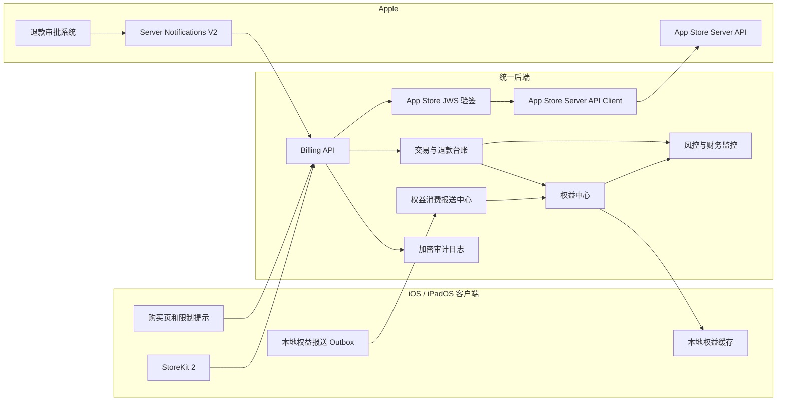
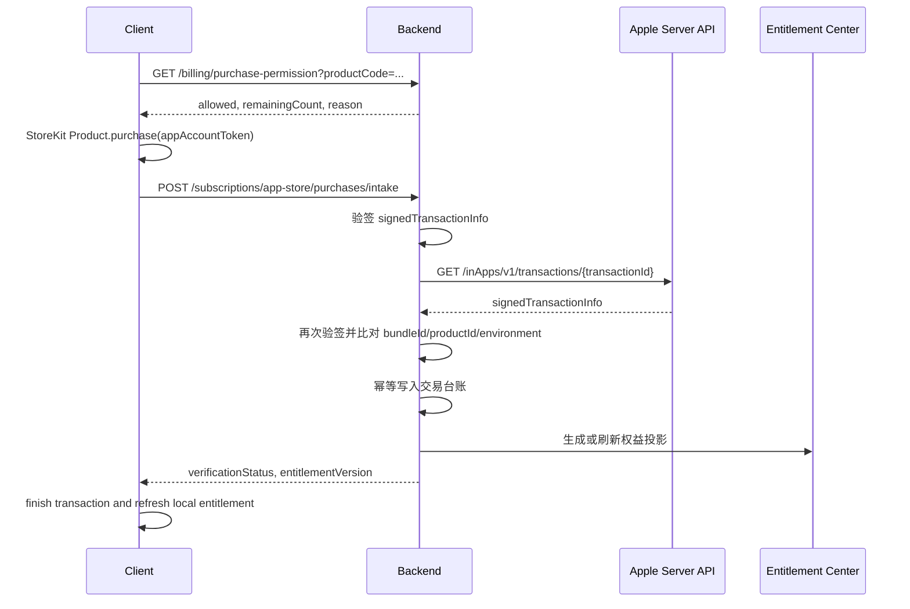
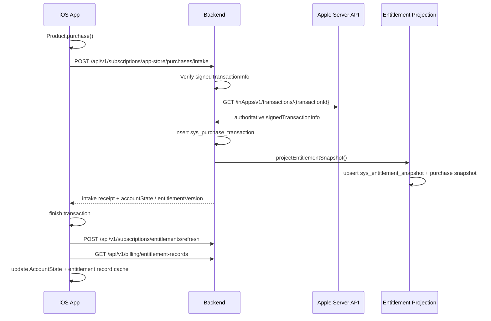
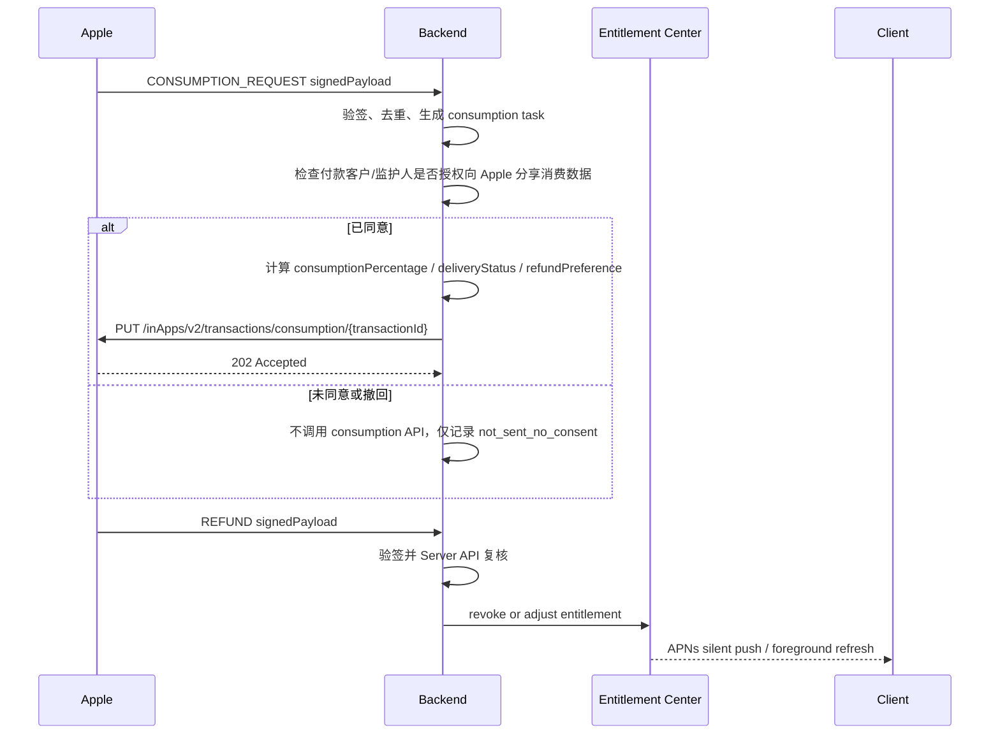
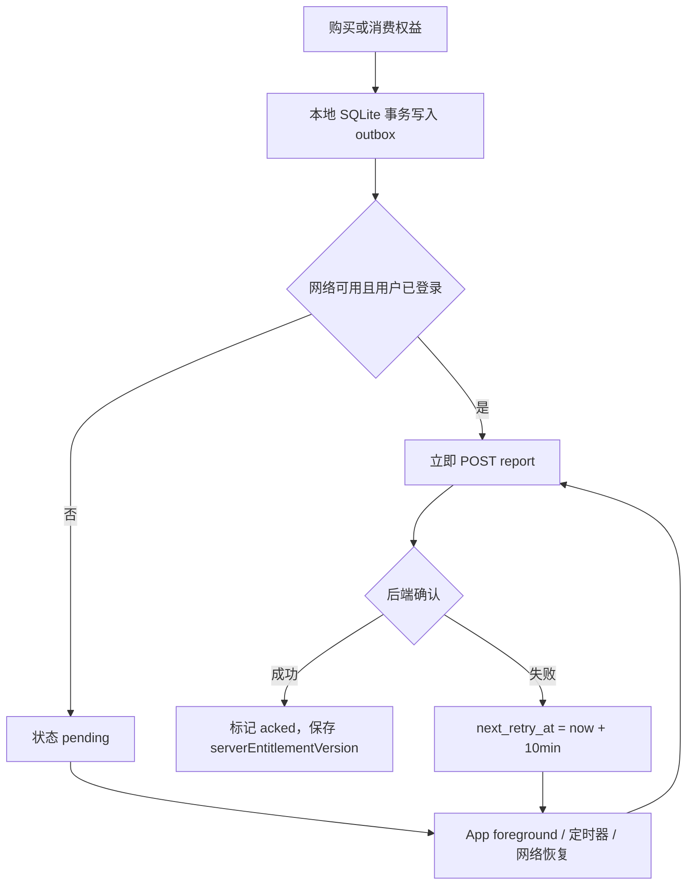

# 拍拍伴读及多 App 通用 App Store 支付与退款架构方案

版本：2026-05-20  
适用范围：拍拍伴读 `paipai_readingcompanion`，以及后续接入统一后端的 iOS / iPadOS / macOS App Store 应用。  
落地目录：`backend/files`。  
法律提示：本文件是工程合规、数据最小化和运维设计，不构成法律意见，也不能免除开发者在隐私、儿童保护、消费者保护、税务和 Apple Developer Program 下的责任。上线前仍应由法律或隐私顾问复核隐私政策、儿童数据、跨境传输、数据留存、退款数据共享同意文案、App Store Connect 隐私标签和面向欧盟的 DSA trader 信息。

## 0. 关键结论

1. 支付验证以 StoreKit 2 + App Store Server API + App Store Server Notifications V2 为主；历史 `verifyReceipt` 只保留 StoreKit 1 兼容路径，不作为新架构主链路。
2. Apple 是退款审批主体。开发者不能自行批准或拒绝 App Store 退款，只能在 Apple 发起 `CONSUMPTION_REQUEST` 后按付款客户/监护人同意情况提供消费信息，并在 Apple 发出 `REFUND` 后做权益回收、对账、风控和用户提示。
3. 当前 Apple `Send Consumption Information` 是 `PUT /inApps/v2/transactions/consumption/{transactionId}`，请求体只允许 `customerConsented`、`consumptionPercentage`、`deliveryStatus`、`sampleContentProvided`、`refundPreference`。旧版包含累计消费金额、累计退款金额、使用时长、用户状态等字段的 V1 `ConsumptionRequestV1` 已废弃。方案仍会在内部 `reply_context_json` 中完整保存累计消费金额、累计退款金额和参与度指标，用于计算 `refundPreference` 和审计，但不把非白名单字段发送给 Apple。
4. 购买记录、退款记录、权益台账、App Store 请求响应日志必须按 `app_code` 隔离，保证拍拍伴读和后续应用共用一套内核但互不串账。
5. 不应依赖 App Store 交易获取用户的真实 Apple ID。交易主关联键应是客户端购买时传入的 `appAccountToken`、后端 `user_id`、`transactionId`、`originalTransactionId`。如果业务因 Sign in with Apple 等渠道可获得 Apple user identifier 或 relay email，只能密文存储，并建立 HMAC blind index 用于对账检索。
6. 本方案不能得出“开发者没有法律责任”的结论。Apple 明确要求开发者自行取得向 Apple 共享消费数据的有效同意；COPPA、GDPR/PIPL 等也把告知、同意、安全、留存、删除和第三方共享责任放在服务提供者/个人信息处理者身上。工程上只能降低和证明风险，不能消灭责任。
7. 儿童数据基线：支付、退款、风控、Apple consumption 回复和客服对账链路只使用家长账号、交易标识、商品、金额、权益摘要和聚合使用次数；不得写入儿童姓名、出生日期、原始图片、原始语音、绘本正文、逐句学习内容、精确位置或可直接识别儿童的 profile 字段。
8. 个人开发者低运维基线：早期只使用 PostgreSQL + Spring scheduled worker + 对象存储加密归档，不引入 Kafka/独立事件总线；必须有最小告警、可手动重放的后台入口、密钥轮换手册、备份恢复演练和隐私请求处理脚本。

### 0.1 本次评估结论

结论：原文的 Apple 支付/退款主链路基本正确，但还不能称为“完全满足欧洲、美国、中国儿童数据安全要求”，也不能支持“开发者没有法律责任”的目标。必须补齐以下阻断项后才能作为提审和开发基线：

1. 儿童数据不得进入支付、退款和 Apple payload 的负面清单。
2. 向 Apple 发送 consumption 信息前，必须取得付款客户/监护人的独立、可撤回、可审计同意；同意不能用 ATT 代替，不能默认勾选。
3. 全球隐私政策、地区附录、儿童数据说明、App Store Privacy Nutrition Label、`PrivacyInfo.xcprivacy`、App Review Notes 和 App 内文案必须与实际数据流一致。
4. 如果 App 面向儿童或进入 Kids Category，第三方广告和第三方分析默认禁用；确需使用第三方 SDK 时必须经过儿童场景合规评估，并在隐私政策和 App Store Connect 中披露。
5. 欧盟上线还需要完成 DSA trader 自评和 App Store Connect 信息；如果你作为个人开发者且属于 trader，地址、电话和邮箱可能会在欧盟 App Store 产品页展示。

## 1. 官方对接基线

| 能力 | Apple 当前接口或机制 | 本方案使用方式 |
| --- | --- | --- |
| 客户端购买 | StoreKit 2 `Product.purchase`、`Transaction`、`Transaction.updates` | 客户端传 `appAccountToken`，购买成功后提交 `signedTransactionInfo` 到后端。 |
| 服务端交易查询 | App Store Server API `GET /inApps/v1/transactions/{transactionId}` | 后端权威复核客户端提交的交易 JWS。 |
| 交易历史修复 | App Store Server API `GET /inApps/v2/history/{anyTransactionId}` | 通知丢失、恢复购买、定期对账时分页拉取历史交易。 |
| 订阅状态 | App Store Server API `GET /inApps/v1/subscriptions/{transactionId}` | 自动续订订阅用于当前状态与最近交易选择。 |
| 服务端通知 | App Store Server Notifications V2 `signedPayload` | 后端验签、去重、记录、按类型处理，返回 2xx 表示接收成功。 |
| 退款消费信息 | App Store Server API `PUT /inApps/v2/transactions/consumption/{transactionId}` | 仅处理付款客户/监护人已同意的 `CONSUMPTION_REQUEST`，12 小时内回复。 |
| 退款最终结果 | Notifications V2 `REFUND` / `REFUND_DECLINED` / `REFUND_REVERSED` | 只在 Apple 最终通知后执行权益善后。 |
| 退款入口 | StoreKit `Transaction.beginRefundRequest` | 可在 App 内引导用户向 Apple 申请，结果以 Apple 通知和交易状态为准。 |

Apple Server API 调用必须使用 App Store Connect API Key 生成 ES256 JWT：header 包含 `alg=ES256`、`kid`、`typ=JWT`；payload 包含 `iss`、`iat`、`exp`、`aud=appstoreconnect-v1`、`bid=bundleId`。每次请求生成短 TTL token，私钥只进入 KMS/Secret Manager，不落普通配置文件。

## 2. 总体架构



### 2.1 组件职责

| 组件 | 职责 |
| --- | --- |
| iOS Billing Client | 拉后端商品和购买限制，调用 StoreKit，提交交易 JWS，监听 `Transaction.updates`，维护本地 outbox。 |
| Billing API Gateway | 统一暴露购买、恢复、权益刷新、报送、通知接收接口；所有写接口带幂等键。 |
| App Store Verification | 验证 Apple JWS `x5c` 证书链、ES256 签名、bundleId、environment、productId、transactionId。 |
| App Store Server API Client | 当前生产域名使用 `https://api.storekit.apple.com/inApps/`，沙盒使用 `https://api.storekit-sandbox.apple.com/inApps/`。 |
| Transaction Ledger | 保存交易、退款、通知、消费回复、请求响应日志；以 `app_code`、`transactionId`、`originalTransactionId` 为核心索引。 |
| Entitlement Center | 根据交易状态投影用户权益，生成 grant、consume、revoke 事件，提供客户端刷新凭证。 |
| Report Center | 接收客户端权益购买/消费报送，跟踪成功状态，失败每 10 分钟重试；服务端也维护 Apple consumption 回复 outbox。 |
| Risk & Finance | 监控退款率、退款金额、净收入、产品质量关联指标，触发告警和购买限制策略。 |
| Audit Vault | 对 App Store 原始请求/响应、JWS、可识别用户字段做加密存储和审计解密。 |

## 3. 支付验证链路



### 3.1 客户端要求

1. 展示购买页前先调用后端 `GET /api/v1/billing/health` 和 `GET /api/v1/billing/purchase-permission`。
2. 商品列表以 StoreKit 返回价格为准，商品启用、权益映射、购买限制以后端为准。前端不得硬编码产品是否可售。
3. 调用 StoreKit 购买时传 `appAccountToken`。建议由后端签发稳定 UUID，字段映射为 `app_code + user_id + app_account_token`。
4. 购买成功后提交：
   - `productId`
   - `transactionId`
   - `originalTransactionId`
   - `environment`
   - `storefront`
   - `appAccountToken`
   - `signedTransactionInfo`
   - `signedRenewalInfo`，如果 StoreKit 可提供
5. 本地只做临时体验缓存，付费权益最终以服务端验签和 Apple Server API 复核后的台账为准。

### 3.2 后端验证规则

1. JWS 结构校验：compact JWS、`alg=ES256`、存在 `x5c`。
2. 证书链校验：leaf 证书、WWDR 中间证书、Apple Root CA；以 payload `signedDate` 作为证书有效性校验时间，避免历史交易因当前证书过期被误拒。
3. payload 校验：`bundleId`、`environment`、`productId`、`transactionId`、`originalTransactionId` 与请求和应用配置一致。
4. Server API 复核：以 Apple 返回的 `signedTransactionInfo` 为权威数据，不能只信客户端提交的 JWS。
5. 幂等：`app_code + transaction_id` 唯一；订阅续期按 `webOrderLineItemId` 或 `transactionId` 去重；恢复购买不重复发放权益。
6. 权益投影：只有 `verification_status=verified` 且未 `revoked/refunded` 的交易可进入权益投影。
7. 异常降级：Apple 429/5xx 时记录 pending，不发放永久权益；可给短期临时权益，但必须配置过期时间和补偿校验任务。

### 3.3 与现有项目对齐

当前工程已有以下基础：

| 现有能力 | 路径或表 | 建议 |
| --- | --- | --- |
| 购买提交 | `ReadingBillingCompatController` | 保留兼容路由，新增通用字段和错误码。 |
| JWS 验签 | `AppStoreSignedJwsVerifier` | 保留，补齐更多交易字段如 `price`、`currency`、`revocationPercentage`。 |
| Server API Client | `LiveAppStoreServerApiClient` | 当前代码中的 `api.storekit.itunes.apple.com` 应升级为 Apple 当前文档域名 `api.storekit.apple.com`。 |
| 通知接收 | `SysAppStoreController` + `SysAppStoreNotificationService` | 增加 `CONSUMPTION_REQUEST`、`REFUND`、`REFUND_REVERSED` 分支和消费信息回复 outbox。 |
| 交易表 | `sys_purchase_transaction` | 保留为主表，增加购买时间、金额、退款、加密原文、订单号等字段或扩展表。 |
| 通知表 | `sys_app_store_notification` | 增加处理 deadline、Apple 重放查询、通知原文密文和处理任务表。 |

### 3.4 付款完成后的权益发放与 App 同步

本项目现有购买验证、交易表、权益投影和 App 全量同步链路可以承载“用户付款完成后立即修改权益并同步到 App 端”，但必须按以下顺序落地，不能只依赖客户端本地 StoreKit 成功状态：



服务端规则：

1. `POST /api/v1/subscriptions/app-store/purchases/intake` 是购买完成后的唯一可信入口；客户端必须提交 `signedTransactionInfo`，后端必须用 App Store Server API 复核。
2. `SysBillingService.verify(...)` 写入 `sys_purchase_transaction` 后，只有 `lookupResult.isVerified=true` 且交易未 revoked/expired 时才能调用 `projectEntitlementSnapshot(...)` 发放或刷新权益。
3. `projectEntitlementSnapshot(...)` 写入或更新 `sys_entitlement_snapshot`，并在非消耗型商品场景调用 `SysEntitlementCenterService.createOrRefreshPurchaseSnapshot(...)`，保护购买当时承诺的套餐权益。
4. 购买成功响应必须让 App 能够立即更新 UI。拍拍伴读兼容接口当前返回 `accountState`；统一接口至少应返回 `verificationStatus`、`processingStatus`、`productId`、`effectivePlanCode` 或 `entitlementVersion`、`refreshRequired=true`。
5. 如果 Apple Server API 429/5xx 或凭证未配置导致交易 pending，不发放永久权益；客户端显示“正在确认购买”，并通过恢复购买、前台刷新和定时刷新补偿。
6. 如果客户端绕过购买限制但 Apple 已成功扣款，服务端仍必须验证合法交易并发放对应权益，同时写风控事件，不能因为本地策略拒绝已扣款交易。

iOS App 规则：

1. 购买成功后先提交 intake，只有后端返回 verified/reconciled 或包含更新后的 `accountState` 后，才把付费权益展示为已生效。
2. `transaction.finish()` 应在后端 intake 成功持久化后执行；如果后端失败，保留 StoreKit 交易，后续通过恢复购买或 `Transaction.currentEntitlements` 再提交。
3. 收到购买成功响应后立即调用现有 `performFullEntitlementSync(reason: "purchase")`：刷新账号状态、订阅状态、购买服务状态、云端用量和权益记录。
4. 本地缓存必须以服务端 `AccountState.entitlement`、`GET /api/v1/billing/entitlement`、`GET /api/v1/billing/entitlement-records` 为准；不能只保存 `isPremium=true`。
5. 购买页、家长中心、孩子档案上限、OCR/TTS/周报等功能入口必须监听账号状态变化，并在 `entitlementVersion` 或 `accountState` 更新后刷新 UI。

## 4. 退款通知与开发者角色



### 4.1 `CONSUMPTION_REQUEST` 处理规则

1. 收到通知后立即验签、去重、落库，生成 `sys_appstore_consumption_request`。
2. 处理 deadline = Apple `signedDate` 或接收时间 + 12 小时；worker 每分钟扫描未处理任务，失败每 10 分钟重试，确保在 deadline 前至少多次尝试。
3. 必须有付款客户/监护人明确同意向 Apple 分享退款消费数据，才能调用 `Send Consumption Information`。该同意与 App Tracking Transparency 无关，不能用 ATT 弹窗替代。
4. 当前 v2 请求体：

```json
{
  "customerConsented": true,
  "consumptionPercentage": 40000,
  "deliveryStatus": "DELIVERED",
  "sampleContentProvided": true,
  "refundPreference": "GRANT_PRORATED"
}
```

5. 合法取值：
   - `deliveryStatus`: `DELIVERED`、`UNDELIVERED_QUALITY_ISSUE`、`UNDELIVERED_WRONG_ITEM`、`UNDELIVERED_SERVER_OUTAGE`、`UNDELIVERED_OTHER`
   - `refundPreference`: `DECLINE`、`GRANT_FULL`、`GRANT_PRORATED`
   - `consumptionPercentage`: 0 到 100000，单位是千分之一百分点；订阅不要传该字段，由 Apple 按时间计算。
6. 如果 `deliveryStatus` 不是 `DELIVERED`，`consumptionPercentage` 必须为 0。
7. 内部 `reply_context_json` 记录用户累计消费金额、累计退款金额、活跃天数、近 30 日使用次数、已消耗权益比例、历史退款率等，但这些字段不直接进入 Apple v2 payload。

### 4.2 `REFUND` 处理规则

1. `REFUND` 是 Apple 最终退款通知。后端收到并验签后，调用 Server API 获取权威交易状态。
2. 根据 `revocationDate`、`revocationReason`、`revocationPercentage`、`transactionId`、`originalTransactionId` 更新交易表和退款 case。
3. 调用权益中心：
   - 订阅：停止或调整当前订阅权益，过期时间不晚于 `revocationDate`。
   - 非消耗型或终身购买：撤销对应永久权益。
   - 消耗型：见 4.4。
4. 生成 `entitlement_version`，触发客户端刷新。
5. 给用户展示中性提示：“Apple 已处理退款，相关权益已同步更新。”不要暗示开发者批准或拒绝退款。

退款完成后的权益同步必须以 Apple 最终通知和 Server API 复核为准：

1. `CONSUMPTION_REQUEST` 只用于向 Apple 提供退款评估信息，不改变用户权益。
2. 只有收到 `REFUND`、`REVOKE`，或 App Store Server API/StoreKit 交易中出现 `revocationDate` 后，才执行权益撤销或调整。
3. 后端处理 `REFUND` 后必须重新调用 App Store Server API，并把权威交易 JWS 中的 `revocationDate` 投影到 `sys_entitlement_snapshot.status=revoked` 或对应退款状态。
4. 退款导致权益变化时必须同时写：
   - `sys_purchase_transaction.refund_status / revocation_at / revocation_reason / revocation_percentage`
   - `sys_appstore_refund_case.refund_case_status`
   - `sys_entitlement_ledger_event` 的 revoke 或 adjust 事件
   - `sys_entitlement_snapshot` 当前投影
   - `sys_user_plan_snapshot` 或购买快照的失效记录，避免退款后旧购买快照继续参与合并
5. 退款同步到 App 端采用“推送 + 拉取”双路径：后端发送 APNs silent push；App 收到后调用 `performFullEntitlementSync(reason: "refund_push")`。如果推送失败，App 前台、冷启动、购买页进入、权益使用前和每小时定时同步都必须兜底刷新。

### 4.3 其他退款相关通知

| 通知 | 处理 |
| --- | --- |
| `REFUND_DECLINED` | Apple 拒绝退款申请。保留权益，关闭退款 case，记录审计。 |
| `REFUND_REVERSED` | Apple 撤销此前退款。重新复核交易，如果未被再次退款，可恢复权益并记录补发。 |
| `REVOKE` | 家庭共享或其他撤销。按 Apple 交易中的 revocation 字段撤权。 |
| `DID_RENEW` / `DID_FAIL_TO_RENEW` / `EXPIRED` | 订阅生命周期事件，刷新权益投影和续订状态。 |

### 4.4 消耗型内购退款特殊流程

消耗型商品的退款处理必须同时考虑“已用”和“未用”。

| 状态 | 处理策略 |
| --- | --- |
| 完全未使用 | 回收全部剩余额度，交易标记 `refunded_unconsumed`。 |
| 部分使用且有剩余 | 优先回收未使用额度；如 Apple `revocationPercentage` 小于 100%，按退款比例折算回收。 |
| 已全部使用 | 不追扣成负数，不向用户二次收费；标记 `refunded_consumed_debt` 作为风控依据，后续可降低购买次数或触发人工审核。 |
| 服务未交付或质量问题 | `deliveryStatus` 置为对应未交付原因，`refundPreference` 通常为 `GRANT_FULL`，同时生成质量事件。 |

### 4.5 退款请求与票据关联查询

这里的“票据”指后端保存的 App Store 交易证据集合，不等同于可明文暴露的 Apple receipt。票据记录由 `sys_purchase_transaction`、加密保存的 `signedTransactionInfo` / `signedRenewalInfo`、Apple Server API 响应 hash、订单号和退款 case 共同组成。

关联查询服务建议命名为 `RefundTicketLookupService`，按以下精确键检索：

| 查询入口 | 查询条件 | 返回内容 |
| --- | --- | --- |
| 用户标识 | `app_code + user_id` | 该用户所有可退款交易、交易状态、已退款状态、权益使用统计。 |
| 订单号 | `app_code + order_no` | 唯一业务订单和对应 Apple `transactionId`，用于客服/财务对账。 |
| Apple 交易 ID | `app_code + transaction_id` | 单笔交易票据、JWS hash、验签结果、权益授予记录。 |
| Apple 原始交易 ID | `app_code + original_transaction_id` | 订阅链路或恢复购买链路的全量交易列表。 |
| App Account Token | `app_code + app_account_token_hash` | 用户迁移、匿名账号合并、Apple 通知回填时的辅助定位。 |

查询规则：

1. `transactionId` 命中时必须返回唯一交易；如果出现重复，标记 `data_integrity_error` 并停止自动退款偏好判断。
2. `order_no` 命中时必须反查 `transactionId` 和 `originalTransactionId`，用于 Apple Server API 复核。
3. 仅有 `user_id` 时只能查询本地交易台账；Apple Server API 不支持按开发者用户 ID 反查 Apple 交易。
4. 本地票据缺失或状态为 pending 时，若已有 `transactionId` 或 `originalTransactionId`，调用 `GET /inApps/v1/transactions/{transactionId}` 或 `GET /inApps/v2/history/{anyTransactionId}` 补齐。
5. 查询结果必须同时包含 `refund_case_id`、`notification_uuid`、`purchase_at`、`product_id`、`price_milli_amount`、`currency`、`verification_status`、`refund_status`、`entitlement_version`。

### 4.6 权益使用次数统计

退款偏好判断前必须计算“已使用权益次数”和“总权益次数”：

| 指标 | 计算来源 | 说明 |
| --- | --- | --- |
| `totalEntitlementCount` | 商品权益映射、购买数量、权益 grant ledger、套餐周期额度 | 消耗型用购买发放额度；订阅用当前账期可用额度；非消耗型若无法量化，必须配置虚拟总次数，否则不触发自动“不支持退款”。 |
| `usedEntitlementCount` | `sys_entitlement_ledger_event` 中已确认 `consume` 事件，叠加已确认的客户端 outbox 报送 | 排除已拒绝、已回滚、重复幂等事件；退款后的消费不计入本次判断。 |
| `usageRatioMilli` | `floor(usedEntitlementCount * 100000 / totalEntitlementCount)` | 与 Apple `consumptionPercentage` 同一单位，100000 表示 100%。 |
| `sampleContentProvided` | 产品配置 | 若购买前有免费试用、样例内容或功能说明，传给 Apple 的字段为 `true`。 |

统计规则：

1. 统计必须在同一个数据库事务或同一只读快照内完成，避免消费报送和退款判断并发导致比例漂移。
2. `totalEntitlementCount <= 0` 或无法确定时，不自动生成“不支持退款”，改为 `decisionCode=manual_review`。
3. 订阅产品可以内部计算使用比例用于 `refundPreference`，但发送 Apple `ConsumptionRequest` 时不要传 `consumptionPercentage`，Apple 会按订阅已过时间自动计算。
4. 儿童维度的学习记录不得进入 Apple payload；仅用 parent `user_id` 下的聚合次数参与计算。

### 4.7 10% 阈值与动态配置

默认规则：当 `usageRatioMilli > usageRatioLimitMilli` 时，系统生成内部反馈结果 `decisionCode=not_support_refund`，中文展示为“不支持退款”。默认 `usageRatioLimitMilli=10000`，即 10%。

注意：这不是开发者直接拒绝 Apple 退款。对 Apple 只能表达退款偏好：`not_support_refund` 映射为 `refundPreference=DECLINE`；Apple 仍保留最终审批权。

阈值存储在现有数据库配置表 `sys_remote_config`，避免新增复杂配置系统：

```sql
-- 全局默认 10%。10000 表示 10.000%。
namespace_code = 'billing_refund_policy'
config_key = 'usage_ratio_limit_milli'
config_value_json = '{"value": 10000}'

-- 可选商品级覆盖。
namespace_code = 'billing_refund_policy'
config_key = 'products.com.paipai.readalong.family.monthly.usage_ratio_limit_milli'
config_value_json = '{"value": 10000}'
```

可视化管理界面要求：

1. 后台配置页按 `app_code` 展示 `billing_refund_policy`，支持全局阈值和商品级覆盖。
2. 输入控件使用百分比，保存时转换为 milliunits；例如 10% 保存为 10000。
3. 校验范围为 0 到 100000，默认值 10000，发布前显示影响商品和最近 30 天模拟命中数。
4. 修改后写入 `sys_remote_config` 并生成配置审计日志；服务端每次判断实时读取 active 配置，或使用不超过 60 秒的本地缓存，确保无需代码变更和系统重启。
5. 每次退款判断都把命中的配置 key、配置值、配置更新时间写入 `sys_refund_decision_log.policy_snapshot_json`，避免事后无法复盘当时阈值。

### 4.8 退款判断结果与 Apple 接口格式

Apple consumption 回复接口：

| 项 | 生产环境 | 沙盒环境 |
| --- | --- | --- |
| URL | `PUT https://api.storekit.apple.com/inApps/v2/transactions/consumption/{transactionId}` | `PUT https://api.storekit-sandbox.apple.com/inApps/v2/transactions/consumption/{transactionId}` |
| Authorization | `Authorization: Bearer {App Store Server API JWT}` | 同生产 |
| Content-Type | `application/json` | 同生产 |
| 成功响应 | HTTP 202 Accepted | HTTP 202 Accepted |
| 需重试响应 | 429、5xx | 429、5xx |
| 不应重试响应 | 400 参数错误、401 鉴权错误、404 交易不存在；如出现 403 或其他永久性 4xx，也按配置/权限问题告警并人工复核 | 同生产 |

内部退款判断输出：

```json
{
  "decisionCode": "not_support_refund",
  "displayMessage": "不支持退款",
  "transactionId": "2000000123456789",
  "usedEntitlementCount": 12,
  "totalEntitlementCount": 100,
  "usageRatioMilli": 12000,
  "usageRatioLimitMilli": 10000,
  "appleRefundPreference": "DECLINE"
}
```

发给 Apple 的 `Send Consumption Information` v2 请求体只能包含 Apple 允许字段。对于非订阅类、已获得付款客户/监护人同意且使用比例超过 10% 的交易，示例为：

```json
{
  "customerConsented": true,
  "consumptionPercentage": 12000,
  "deliveryStatus": "DELIVERED",
  "sampleContentProvided": true,
  "refundPreference": "DECLINE"
}
```

发送规则：

1. `CONSUMPTION_REQUEST` 通知接收接口本身返回 2xx 表示通知已接收；真正的退款偏好通过 `PUT /inApps/v2/transactions/consumption/{transactionId}` 单独发送给 Apple。
2. Apple 成功接收 consumption 信息时返回 HTTP 202。后端记录请求 hash、响应状态、响应体密文和 `attempt_count`。
3. 付款客户/监护人未同意共享退款消费数据时，不调用 `Send Consumption Information`；通知接收接口仍可返回 2xx，日志标记 `not_sent_no_consent`。
4. `usageRatioMilli > threshold` 时，内部 `not_support_refund` 映射为 `refundPreference=DECLINE`。
5. `usageRatioMilli = 0` 且交付正常时，可映射为 `GRANT_FULL`；`0 < usageRatioMilli < 100000` 且未超过阈值时，可映射为 `GRANT_PRORATED`。如果已 100% 使用但因质量或交付问题仍建议退款，应优先进入人工复核，避免生成与 Apple 字段约束冲突的 payload。
6. 如果 `deliveryStatus` 不是 `DELIVERED`，`consumptionPercentage` 必须为 0；这种场景通常不应输出“不支持退款”。
7. `customerConsented=true` 只能表示付款客户/监护人已同意向 Apple 分享本次退款所需的有限消费信息；不得把儿童或其他家庭成员的同意推断为付款客户同意。

## 5. 数据库设计

### 5.1 设计原则

1. 所有核心表都有 `app_code`，所有跨 App 查询都必须带 `app_code`。
2. Apple 交易唯一性以 `transactionId` 为主；订阅链路同时保留 `originalTransactionId`、`webOrderLineItemId`。
3. 金额使用整数存储：Apple `price` 是价格乘以 1000，数据库使用 `price_milli_amount` 和 `currency`，财务汇总另存 USD 或 CNY 折算快照。
4. JWS 原文和 App Store 请求/响应原文使用 envelope encryption 存储；普通业务表只保留 hash、解码后的必要字段和审计指针。
5. Apple ID 或 email 如可获取，保存三列：
   - `*_ciphertext`: AES-256-GCM 密文，可在授权审计流程中解密。
   - `*_blind_index`: HMAC-SHA256，用于精确查询对账。
   - `*_mask`: UI 或人工核对展示，如 `z***@privaterelay.appleid.com`。

### 5.2 核心表

| 表 | 用途 |
| --- | --- |
| `sys_purchase_transaction` | 交易主表，扩展购买时间、金额、退款、加密原文和 Apple 字段。 |
| `sys_app_store_notification` | Apple 通知接收、验签、去重和处理状态。 |
| `sys_appstore_refund_case` | 一次退款申请/结果的生命周期，关联 `CONSUMPTION_REQUEST` 和 `REFUND`。 |
| `sys_appstore_consumption_request` | Apple consumption 回复任务，记录 12 小时 deadline、重试和 v2 payload。 |
| `sys_refund_decision_log` | 退款偏好判断过程日志，记录票据查询、权益使用统计、10% 阈值命中和 Apple payload 摘要。 |
| `sys_user_entitlement_grant` / `sys_entitlement_snapshot` | 当前项目已有权益授予和投影。 |
| `sys_entitlement_ledger_event` | 权益 grant、consume、revoke 的不可变台账。 |
| `sys_entitlement_version_counter` | `app_code + user_id` 维度的权益版本号计数器；购买、退款、撤销、恢复、过期投影变化时递增。 |
| `sys_entitlement_consumption_report` | 客户端权益消费报送记录和幂等状态。 |
| `sys_remote_config` | 动态配置表；`billing_refund_policy` namespace 存储退款使用比例阈值和商品级覆盖。 |
| `sys_purchase_limit_policy` | 后端配置购买次数、退款率、冷却时间阈值。 |
| `sys_purchase_limit_counter` | 用户/商品/周期维度计数，供 UI 展示剩余次数。 |
| `sys_appstore_interaction_log` | App Store 请求/响应审计日志，敏感原文加密。 |
| `sys_user_push_device` | APNs 设备 token 注册表；退款、撤销、恢复、订阅过期后发送权益刷新 silent push。 |
| `sys_apple_identity_link` | 可选的 Apple user identifier/email 加密索引表。 |
| `sys_finance_risk_daily` | 日级收入、退款、风险指标汇总。 |
| `v_sys_purchase_refund_usage_summary` | 购买票据和权益使用的退款统计视图，供运营、客服、财务直接查询。 |

完整 SQL 草案见同目录 `appstore-payment-refund-ddl-draft-20260520.sql`。

### 5.3 退款标记字段与统计视图

购买和票据使用记录必须显式标记退款状态，不能只依赖业务事件名称推断。

| 数据层 | 字段 | 用途 |
| --- | --- | --- |
| 购买票据 `sys_purchase_transaction` | `refund_status` | 主退款状态：`none`、`requested`、`consumption_requested`、`refunded`、`refund_declined`、`refund_reversed`、`revoked`。 |
| 购买票据 `sys_purchase_transaction` | `revocation_at`、`revocation_reason`、`revocation_percentage` | Apple 最终退款或撤销后的权威字段，来自交易 JWS。 |
| 退款 case `sys_appstore_refund_case` | `refund_case_status`、`decision_code`、`usage_count_used`、`usage_count_total`、`usage_ratio_milli` | 退款请求生命周期和 10% 判断结果。 |
| 权益台账 `sys_entitlement_ledger_event` | `refund_status`、`refund_case_id`、`refund_effect_type`、`refunded_quantity`、`refunded_at` | 标记某条 grant/consume/revoke 是否已被退款影响，方便按权益维度统计。 |
| 客户端报送 `sys_entitlement_consumption_report` | `refund_status`、`refund_case_id`、`refund_effect_type`、`refunded_at`、`counted_in_refund_decision` | 标记某次本地消费报送是否计入退款判断，以及后续是否被退款覆盖。 |
| 判断日志 `sys_refund_decision_log` | `decision_code`、`apple_refund_preference`、`comparison_result_json` | 记录“不支持退款”判断和发送 Apple 的偏好映射。 |

推荐枚举：

| 字段 | 取值 |
| --- | --- |
| `refund_status` | `none`、`requested`、`consumption_requested`、`decision_sent`、`refunded`、`refund_declined`、`refund_reversed`、`revoked`、`manual_review`。 |
| `refund_effect_type` | `none`、`revoke_unused`、`revoke_remaining`、`consumed_debt`、`subscription_cutoff`、`restore_after_reversal`。 |

统计查询优先使用 `v_sys_purchase_refund_usage_summary`：

```sql
SELECT
    app_code,
    product_id,
    purchase_refund_status,
    COUNT(*) AS ticket_count,
    SUM(total_entitlement_count) AS total_count,
    SUM(used_entitlement_count) AS used_count,
    SUM(refunded_used_entitlement_count) AS refunded_used_count
FROM public.v_sys_purchase_refund_usage_summary
WHERE app_code = 'paipai_readingcompanion'
GROUP BY app_code, product_id, purchase_refund_status
ORDER BY ticket_count DESC;
```

### 5.4 隐私字段处理

| 数据 | 存储方式 | 查询方式 | 留存建议 |
| --- | --- | --- | --- |
| Apple user identifier | AES-GCM 密文 + HMAC blind index + key version | 通过 blind index 精确查找，授权后解密 | 账号存续期；注销后如无法律义务则删除密文，仅留不可逆 hash。 |
| Apple relay email | AES-GCM 密文 + blind index + mask | mask 展示，blind index 查找 | 同上。 |
| `appAccountToken` | 可视为持久伪名标识，建议加密或至少 HMAC 索引 | token hash 查找 | 与交易留存周期一致。 |
| JWS 原文 | 密文或对象存储加密，业务表保存 hash | 通过交易或日志 ID 拉取 | 热 180 天，冷 7 年或按财务留存要求。 |
| IP、设备、崩溃关联 | 最小化，聚合优先，原始字段短留存 | 仅风控和安全审计 | 30 到 180 天，按地区配置。 |
| 儿童相关数据 | 不进入支付日志；只保留 parent `user_id` 和权益摘要 | 不用儿童姓名对账 | 严格最小化。 |

## 6. 后端 API 规范

### 6.1 客户端购买前检查

`GET /api/v1/billing/purchase-permission?productCode={productCode}&locale=zh-Hans`

响应：

```json
{
  "allowed": false,
  "status": "limited",
  "reasonCode": "refund_risk_cooldown",
  "message": "近期退款次数较多，今日还可购买 0 次。请稍后再试。",
  "remainingCount": 0,
  "limitWindow": "P1D",
  "limitResetAt": "2026-05-21T00:00:00+08:00",
  "checkedAt": "2026-05-20T10:00:00Z"
}
```

前端要求：

1. `allowed=false` 时付款按钮置灰。
2. 必须展示 `message`、剩余次数和限制原因。
3. 恢复购买入口不能因为购买限制被隐藏。

### 6.2 提交购买交易

`POST /api/v1/subscriptions/app-store/purchases/intake`

请求：

```json
{
  "productId": "com.paipai.readalong.family.monthly",
  "transactionId": "2000000123456789",
  "originalTransactionId": "2000000123000000",
  "environment": "Production",
  "storefront": "CHN",
  "appAccountToken": "550e8400-e29b-41d4-a716-446655440000",
  "signedTransactionInfo": "eyJhbGciOiJFUzI1NiIsIng1YyI6Wy...",
  "signedRenewalInfo": "eyJhbGciOiJFUzI1NiIsIng1YyI6Wy...",
  "idempotencyKey": "purchase-2000000123456789"
}
```

响应：

```json
{
  "intakeId": 12345,
  "processingStatus": "reconciled",
  "verificationStatus": "verified",
  "productId": "com.paipai.readalong.family.monthly",
  "entitlementVersion": 87,
  "refreshRequired": true
}
```

错误码：

| HTTP | code | 含义 | 客户端处理 |
| --- | --- | --- | --- |
| 400 | `invalid_payload` | 缺字段或格式错误 | 不重试，提示稍后恢复购买。 |
| 409 | `duplicate_transaction` | 幂等重复 | 直接刷新权益。 |
| 422 | `transaction_rejected` | product/environment/bundle mismatch | 不发放权益，提示联系支持。 |
| 429 | `apple_rate_limited` | Apple 限流 | 后端 pending，客户端稍后刷新。 |
| 503 | `apple_unavailable` | Apple 暂不可用 | 本地保留 pending，后台重试。 |

### 6.3 权益消费报送

`POST /api/v1/billing/entitlement-events/report`

请求：

```json
{
  "deviceId": "ios-device-install-id",
  "appInstanceId": "install-uuid",
  "events": [
    {
      "eventId": "018fbb49-8ea2-7c32-9ef1-cd88d40c8848",
      "idempotencyKey": "paipai:101:cloud_ocr:local-seq-99",
      "eventType": "consume",
      "entitlementCode": "cloud_ocr",
      "entitlementTokenId": "token-123",
      "transactionId": "2000000123456789",
      "quantity": 1,
      "clientEntitlementVersion": 86,
      "localCreatedAt": "2026-05-20T10:01:00+08:00"
    }
  ]
}
```

响应：

```json
{
  "accepted": ["018fbb49-8ea2-7c32-9ef1-cd88d40c8848"],
  "rejected": [],
  "serverEntitlementVersion": 87,
  "refreshRequired": false
}
```

### 6.4 权益刷新和 App 同步接口

拍拍伴读现有兼容接口：

| 接口 | 用途 | App 调用时机 |
| --- | --- | --- |
| `GET /api/v1/billing/entitlement` | 读取当前账号权益摘要。 | 冷启动、前台恢复、购买页进入、权益使用前。 |
| `POST /api/v1/subscriptions/entitlements/refresh` | 触发后端按 App Store 交易刷新权益投影。 | 购买 intake 成功后、收到退款推送后、恢复购买后、定时同步。 |
| `GET /api/v1/billing/entitlement-records` | 拉取权益发放/消耗/过期记录，更新本地记录缓存。 | 家长中心、购买完成后、退款后、每日首次同步。 |
| `GET /api/v1/subscriptions/status` | 查询订阅状态、最近交易和验证准备度。 | 购买页、家长中心、问题排查。 |

统一系统接口：

| 接口 | 用途 |
| --- | --- |
| `GET /api/v1/system/billing/apps/{appCode}/entitlements` | 按 appCode 查询当前用户权益快照。 |
| `POST /api/v1/system/billing/apps/{appCode}/entitlements/refresh` | 按 appCode 刷新当前用户权益投影。 |

响应要求：

1. 权益响应必须包含当前有效套餐、权益列表、过期时间、撤销时间或撤销状态、服务端校验来源、服务端时间和可比较的版本字段。
2. 兼容当前 iOS 模型时，购买 intake 可以直接返回 `accountState`；统一接口未来应显式返回 `entitlementVersion`，避免 App 端只能靠全量状态差异判断是否刷新。
3. `refreshRequired=true` 表示客户端必须立刻调用权益刷新接口并重读账号状态。
4. `serverEntitlementVersion` 小于或等于本地版本时，客户端可跳过 UI 重绘；大于本地版本时必须刷新购买页、家长中心、孩子档案上限和付费功能入口。
5. 后端返回 `entitlement_revoked`、`subscription_expired`、`purchase_pending` 时，客户端不得继续展示已付费可用状态。

### 6.5 Apple 通知接收

`POST /api/v1/system/appstore/apps/{appCode}/notifications`

Apple V2 请求体：

```json
{
  "signedPayload": "eyJhbGciOiJFUzI1NiIsIng1YyI6Wy..."
}
```

响应策略：

1. 验签成功并已持久化，返回 200 到 206 或 202 均可。本项目当前返回 202，属于 2xx 成功范围。
2. 数据库暂时不可写或系统不可用，返回 5xx 让 Apple 重试。
3. 无法修复的非法签名，建议落拒绝审计后返回 2xx，避免无效通知反复重放；如果怀疑是临时证书链配置问题，则返回 5xx。
4. 生产环境中，Apple Notifications V2 在初次投递失败后会继续重试；沙盒通常只投递一次。因此生产告警必须监控 5xx、worker lag 和 notificationUUID 去重状态，沙盒测试不能依赖自动重试。

## 7. 购买次数限制与 UI 机制

### 7.1 策略配置

配置表 `sys_purchase_limit_policy` 或现有 `sys_remote_config` 的 `billing_purchase_control` namespace 支持：

```json
{
  "scope": "user_product",
  "window": "P1D",
  "maxPurchaseCount": 5,
  "maxRefundCount": 2,
  "maxRefundRate": 0.4,
  "cooldownMinutes": 1440,
  "messages": {
    "zh-Hans": "近期购买或退款次数较多，今日还可购买 {remaining} 次。",
    "en": "Recent purchase or refund activity is high. Remaining purchases today: {remaining}."
  }
}
```

### 7.2 判定规则

1. 购买前强制检查，防止进入 StoreKit 后才失败。
2. 购买次数只限制新购买，不限制恢复购买和已付费权益使用。
3. 如果客户端绕过检查但 Apple 已完成扣款，后端必须验证合法交易并发放对应权益，同时标记风控事件；不能因为本地策略拒绝已成功扣款的 Apple 交易。
4. 退款频繁用户可进入冷却期，但提示必须具体、可解释、非歧视，并支持客服申诉。
5. 阈值按 `app_code + product_id + storefront + user_id` 可配置，默认拍拍伴读消耗型资源包每日 5 次，订阅类每日 2 次。

### 7.3 UI 提示

购买页需要展示：

1. 剩余可购买次数：如“今日还可购买 2 次”。
2. 限制原因：如“近期退款次数较多，系统暂时限制重复购买”。
3. 重置时间：如“将在 2026-05-21 00:00 后恢复”。
4. 恢复购买入口和客服联系入口。

## 8. 权益消费报送与离线补偿



### 8.1 iOS 本地 Outbox

客户端本地 SQLite 表建议：

```sql
CREATE TABLE entitlement_report_outbox (
    id TEXT PRIMARY KEY,
    app_code TEXT NOT NULL,
    user_id TEXT NOT NULL,
    event_type TEXT NOT NULL,
    entitlement_code TEXT NOT NULL,
    entitlement_token_id TEXT,
    transaction_id TEXT,
    quantity INTEGER NOT NULL,
    idempotency_key TEXT NOT NULL UNIQUE,
    payload_json TEXT NOT NULL,
    status TEXT NOT NULL DEFAULT 'pending',
    attempt_count INTEGER NOT NULL DEFAULT 0,
    next_retry_at TEXT,
    last_error_code TEXT,
    created_at TEXT NOT NULL,
    updated_at TEXT NOT NULL
);
```

触发时机：

1. 购买验证成功并发放权益后，记录 `grant_confirmed`。
2. 使用 OCR、TTS、句卡、周报等权益时，记录 `consume`。
3. 收到后端退款撤权或本地 StoreKit `revocationDate` 时，记录 `revoke_seen`。
4. App 冷启动、前台恢复、网络恢复、每 10 分钟定时器都扫描 pending/failed 记录。

### 8.2 服务端校验规则

1. `eventId` 必须是 UUID，`idempotencyKey` 在 `app_code + user_id` 内唯一。
2. `entitlementTokenId` 必须属于当前用户和当前 app，且状态未 revoked。
3. `transactionId` 如存在，必须能关联到已验证交易。
4. `quantity` 必须大于 0，不能导致服务端权益余额为负；如果服务端已因退款撤权，返回 `entitlement_revoked` 并要求客户端刷新。
5. `clientEntitlementVersion` 低于服务端版本时，服务端可接受报送但返回 `refreshRequired=true`。
6. 客户端本地时间只作为参考，最终以服务端接收时间和交易台账为准。

### 8.3 数据一致性策略

1. 服务端是付费权益和退款状态的唯一真源。
2. 客户端可以在无网络时先记本地消费，但高价值权益必须设置短 TTL server proof，例如 15 分钟。
3. 每次报送响应都返回 `serverEntitlementVersion`；客户端版本落后则刷新 `GET /billing/entitlement`。
4. 对冲突事件使用“先退款撤权，后消费拒绝”的规则，不允许继续消耗已退款权益。
5. 报送失败不删除本地 outbox；直到后端确认或返回永久拒绝且客户端完成本地修正。

### 8.4 低运维存储建议

1. 后端真源使用 PostgreSQL，不引入独立事件总线即可满足早期规模。
2. outbox worker 使用 Spring `@Scheduled` + `SELECT ... FOR UPDATE SKIP LOCKED`，避免多实例重复处理。
3. Redis 只用于短期锁和速率限制，不作为权益真源。
4. 大体积加密请求响应可进入对象存储，数据库保存 hash、key version 和对象 key。

## 9. 退款后权益管理

### 9.1 权益状态机

用户权益状态必须由服务端统一维护，App 端只缓存投影。建议状态机：

| 状态 | 进入条件 | App 端表现 |
| --- | --- | --- |
| `pending` | 购买已提交但 Apple Server API 暂未复核成功。 | 显示“正在确认购买”，不开放永久权益，可给短 TTL 临时体验。 |
| `active` | 交易 verified，未过期，未退款/撤销。 | 付费功能可用，显示有效期和权益额度。 |
| `expired` | 订阅或限时权益到期。 | 停止新增付费功能，历史内容按产品规则只读。 |
| `revoked` | Apple `REFUND` / `REVOKE` / `revocationDate` 生效。 | 停止相关权益，展示中性同步提示。 |
| `refund_reversed` | Apple `REFUND_REVERSED` 后重新复核有效。 | 恢复权益并刷新 UI。 |
| `manual_review` | 交易、退款或权益统计不一致。 | 保守降级，不自动放大权益，提示联系支持。 |

状态变更规则：

1. 购买完成只能从 `pending` 或空状态进入 `active`，前提是服务端验签和 App Store Server API 复核通过。
2. 退款完成只能由 Apple 最终状态触发，不由 App 内“申请退款”按钮触发。
3. `revoked` 优先级高于 `active`；同一 `originalTransactionId` 下只要最新权威交易显示撤销，App 端必须停用相关权益。
4. `REFUND_REVERSED` 不能直接恢复 UI，必须重新查询 App Store Server API，确认交易没有再次 revoked 后再进入 `active`。
5. 状态机变化必须生成递增 `entitlementVersion`，供 App 判断是否需要刷新。

### 9.2 实时刷新机制

1. 后端处理 `REFUND` 后更新 `entitlement_version`。
2. 如果用户有可达设备，发送 APNs silent push，payload 只包含 `type=entitlement_refresh` 和版本号，不包含敏感数据。
3. App 前台、冷启动、购买页进入、权益使用前都调用刷新接口。
4. StoreKit `Transaction.updates` 本地监听到 `revocationDate` 时，立即冻结对应本地权益并向后端报送。
5. APNs silent push 只能作为加速通道，不能作为唯一通道；App 必须用冷启动、前台恢复、购买页刷新、家长中心刷新和每小时 `performFullEntitlementSync(reason: "timer")` 兜底。
6. 推送 payload 示例：

```json
{
  "aps": { "content-available": 1 },
  "type": "entitlement_refresh",
  "appCode": "paipai_readingcompanion",
  "entitlementVersion": 88,
  "reason": "refund"
}
```

App 收到后只把它作为“需要拉取”的信号，不信任推送里的权益内容。

### 9.3 App 端同步规则

本项目 iOS 端已有 `performFullEntitlementSync(reason:)`、`refreshEntitlementSnapshot()`、`refreshAccountState(force:)`、`syncEntitlementRecordsFromBackend(...)` 和本地 `reading_entitlement_record_cache`。文档要求按以下方式使用：

1. 购买成功：`purchase()` -> `submitTransactionIntake(source: .purchase)` -> 后端返回成功 -> `transaction.finish()` -> `performFullEntitlementSync(reason: "purchase")` -> 更新 `accountState.entitlement` 和权益记录缓存。
2. 恢复购买：`AppStore.sync()` -> 遍历 `Transaction.currentEntitlements` -> `submitTransactionIntake(source: .restore)` -> `performFullEntitlementSync(reason: "restore")`。
3. 退款完成：收到 APNs 或本地 `Transaction.updates.revocationDate` -> 立即冻结本地相关权益 -> `performFullEntitlementSync(reason: "refund")` -> 以服务端返回为准恢复或保持冻结。
4. 前台/冷启动：如果本地权益缓存超过 1 小时、存在 pending purchase、最近收到退款/撤销信号，必须触发完整同步。
5. 高价值功能入口：调用 OCR/TTS/周报/多孩子管理前，若 `accountState.entitlement.serverVerified=false`、本地版本落后或缓存过期，先刷新权益；刷新失败时按保守策略降级。
6. 本地 UI 不得只依赖 StoreKit 当前状态；Apple 交易状态和服务端权益投影不一致时，以服务端投影为准，并保留“恢复购买/刷新权益”入口。
7. App 展示给用户的文案应为“权益已同步更新”“正在确认购买”“请刷新权益”，不要显示 Apple 内部交易字段或暗示开发者审批退款。

### 9.4 已退款权益不可继续使用

1. 服务端 API 对高价值操作强制调用 `AppEntitlementAccessGuard` 或等价后端权限判断。
2. 本地缓存必须包含 `expiresAt`、`revokedAt`、`entitlementVersion`，不能只保存 `isPremium=true`。
3. 离线允许范围按产品配置：
   - 订阅和终身权益：最多允许短期离线宽限，如 24 小时，但一旦本地 StoreKit 发现 revocation 立即停用。
   - 消耗型权益：可离线消费但必须 outbox 报送，未确认额度达到上限后禁止继续离线消费。

### 9.5 回收流程

| 权益类型 | 未使用 | 已使用 | 审计 |
| --- | --- | --- | --- |
| 订阅 | 停止未来服务，刷新过期时间 | 已产生历史内容保留，但不再生成新权益 | 记录 `refund_revoke_subscription` |
| 非消耗型 | 移除功能开关 | 之前生成的数据保留或降级只读，按隐私政策处理 | 记录 `refund_revoke_non_consumable` |
| 消耗型 | 回收剩余额度 | 不追负数，记录 consumed debt 和风险标记 | 记录 `refund_revoke_consumable` |
| 家庭/多孩子权益 | 停止所有子档案的付费功能 | 历史报告保留只读或按产品规则隐藏 | 记录 parent user_id，不记录儿童敏感明文 |

### 9.6 端到端可用性结论

结合当前项目结构，购买后发放权益的基础链路已经可用；Apple 退款后修改权益并同步到 App 端具备可承载的投影机制，但不能视为已完整上线，必须补齐以下实现细节：

1. 当前通知接收会做通用 reconciliation；上线前必须按 `notificationType` 显式路由 `REFUND` / `REVOKE` / `REFUND_REVERSED`，调用权益投影刷新，并让购买快照失效或恢复，避免 `sys_user_plan_snapshot` 继续给退款交易合并权益。
2. 权益响应需要显式暴露可比较的 `entitlementVersion`；当前 iOS 可先用 `accountState` 全量刷新兜底，但长期应避免只靠状态对象差异。
3. APNs silent push 需要设备 token 表、用户设备绑定、失败重试和观测；未接入前，必须依赖前台/冷启动/定时同步兜底。
4. iOS 需要监听 StoreKit `Transaction.updates`；发现 `revocationDate` 后先本地冻结，再拉服务端确认。
5. 购买、退款、恢复购买、订阅过期都必须覆盖自动化或 sandbox 回归，确认 App UI、后端快照、权益记录页和高价值功能权限一致。

## 10. 日志与审计

### 10.1 日志范围

必须记录：

1. 客户端购买提交请求和后端响应。
2. Apple Server API 请求、HTTP 状态、错误码、响应 hash、必要解码字段。
3. Apple 通知 `signedPayload` hash、notificationUUID、notificationType、subtype、验签结果。
4. `CONSUMPTION_REQUEST` 回复 payload、Apple HTTP 响应、重试记录。
5. `REFUND` 权益回收前后快照。
6. 管理员或客服查看、解密、导出交易信息的审计日志。
7. 退款判断过程中的票据查询条件、票据命中结果、权益使用统计、阈值比较结果、内部 `decisionCode` 和映射后的 Apple `refundPreference`。

### 10.2 Apple 入站内容记录

Apple 发送到后端的每一条通知都必须形成不可变入站记录，至少包含：

| 字段 | 存储位置 | 说明 |
| --- | --- | --- |
| `notificationUUID` | 明文索引 | 用于 Apple 通知去重，`app_code + notificationUUID` 唯一。 |
| `notificationType` / `subtype` | 明文索引 | 例如 `CONSUMPTION_REQUEST`、`REFUND`、`REFUND_DECLINED`、`REFUND_REVERSED`。 |
| `version` / `signedDate` | 明文 | 用于验签、deadline 和审计排序。 |
| `environment` / `bundleId` / `appAppleId` | 明文 | 用于确认通知属于当前 App 和环境。 |
| `signedPayload` 原文 | 密文 + hash | 原文必须加密保存；业务查询使用 hash 和 decoded summary。 |
| `data.signedTransactionInfo` | 密文 + hash | 验签后解码出 `transactionId`、`originalTransactionId`、`productId`、`purchaseDate`、`revocationDate` 等必要字段。 |
| `data.signedRenewalInfo` | 密文 + hash | 自动续订订阅需要保存并验签。 |
| HTTP 入站信息 | 脱敏摘要 | 保存接收时间、URL、HTTP method、requestId、来源 IP 所属国家或 hash；不保存敏感 header 明文。 |
| 验签结果 | 明文摘要 | `verification_status`、证书链校验结果、错误码、Apple root key version。 |
| 处理结果 | 明文摘要 | `processing_status`、关联 `refund_case_id`、`consumption_request_id`、重试次数。 |

`rawPayloadJson` 只保存脱敏 summary；完整 `signedPayload` 和 Apple 返回原文进入 `sys_appstore_interaction_log.request_ciphertext` / `response_ciphertext` 或对象存储加密区。

### 10.3 退款判断日志字段

`sys_refund_decision_log` 每次判断写一行，不允许覆盖旧记录：

1. `lookup_input_json`: 本次查询入口，如 `userId`、`orderNo`、`transactionId`。
2. `ticket_snapshot_json`: 命中的交易票据摘要，包括订单号、交易 ID、商品、购买时间、退款状态、票据 hash。
3. `usage_snapshot_json`: `usedEntitlementCount`、`totalEntitlementCount`、`usageRatioMilli`、统计时间窗口、纳入/排除的 ledger event 数。
4. `policy_snapshot_json`: 命中的 `billing_refund_policy` 配置 key、阈值、更新时间、操作人。
5. `comparison_result_json`: 比较结果，如 `12000 > 10000`、`thresholdExceeded=true`。
6. `decision_code` / `display_message`: 内部反馈，如 `not_support_refund` / `不支持退款`。
7. `apple_payload_hash` / `apple_payload_ciphertext`: 发送 Apple 的 v2 `ConsumptionRequest` payload。
8. `apple_http_status` / `apple_response_ciphertext`: Apple 返回结果，成功期望为 202。

### 10.4 敏感数据处理

1. 普通应用日志不得输出完整 JWS、Apple email、Apple user identifier、API private key、Authorization header。
2. 审计表中如需保存请求/响应原文，必须字段级或对象级加密。
3. 搜索和对账使用 hash/blind index，不使用明文 LIKE 查询。
4. 解密流程必须有 break-glass 权限、工单号、双人审批或至少强审计。
5. key rotation 通过 `key_version` 实现，旧密文可懒迁移或后台重加密。

### 10.5 存储与轮转

| 日志 | 热存储 | 冷存储 | 删除或匿名化 |
| --- | --- | --- | --- |
| 应用运行日志 | 14 到 30 天 | 可选 90 天 | 默认 90 天内删除。 |
| App Store 交互日志 | 180 天 | 加密对象存储 7 年 | 满财务/争议留存期删除密文。 |
| 交易主记录 | 当前库 | 备份归档 | 通常按财税要求 7 到 10 年。 |
| 隐私身份密文 | 当前库 | 不建议冷存明文等价密文 | 账号注销且无留存义务后删除密文，保留不可逆交易索引。 |

## 11. 风控、质量与财务预警

### 11.1 退款率监控

指标：

1. `refund_count_1d/7d/30d`
2. `refund_amount_milli_1d/7d/30d`
3. `refund_rate_by_product = refund_count / purchase_count`
4. `refund_amount_rate = refund_amount / gross_amount`
5. `consumed_refund_rate = fully_consumed_refund_count / refund_count`

建议告警：

| 等级 | 条件 |
| --- | --- |
| warning | 单商品 7 日退款率 > 5%，且购买数 >= 20。 |
| critical | 单商品 7 日退款率 > 10%，或退款金额占收入 > 15%。 |
| abuse_watch | 用户 30 日退款次数 >= 3，或已用后退款次数 >= 2。 |
| quality_watch | `UNDELIVERED_QUALITY_ISSUE` 或崩溃相关退款占比 > 20%。 |

### 11.2 App 质量关联

1. 客户端接入 MetricKit，采集崩溃、卡顿、启动、内存压力聚合指标。
2. 关联 App Store Connect 评论评分、客服工单、崩溃版本、退款商品。
3. 若某版本退款率和崩溃率同步上升，应优先触发质量修复和 App Store 版本下架/灰度策略，而不是提高用户购买限制。

### 11.3 财务风险

1. 每日按 `app_code + product_id + storefront + currency` 汇总 gross、refund、net。
2. 保留购买时价格和币种，汇率折算使用交易日固定汇率快照。
3. 退款金额超过最近 7 日平均收入 20% 时告警。
4. 对 `REFUND_REVERSED` 做反向财务调整，不能简单累计为新收入。

## 12. 全球隐私标准与地区附录

本方案采用“全球统一高标准 + 地区附录”的隐私说明结构。全球基础版适用于所有用户，默认按儿童和家庭场景的更高保护要求设计；地区附录只补充当地法律要求，不降低基础版保护水平。

### 12.1 全球隐私说明标准

隐私政策、儿童数据说明、App Store 隐私标签、`PrivacyInfo.xcprivacy`、App Review Notes、客服话术和 App 内隐私入口必须基于同一份数据流清单生成。全球基础版至少包含：

1. 主体信息：开发者名称、联系邮箱、隐私请求入口、适用范围、版本日期。
2. 数据类别：账号、家长联系方式、儿童档案、学习记录、相机/相册输入、设备与诊断、购买与退款、客服与安全审计。
3. 处理目的：提供陪读功能、家庭档案管理、购买验证、恢复购买、退款处理、客服排障、安全防护、法定义务和产品质量改进。
4. 是否必须提供：区分核心功能必需数据、可选功能数据和完全可拒绝的数据。
5. 第三方接收方：Apple、云服务商、崩溃诊断、客服工具、邮件服务、对象存储和任何 SDK；列出类别、目的、数据类型和退出路径。
6. 数据留存：按账号、儿童档案、学习记录、支付交易、App Store 交互日志、客服记录、应用日志分别设置期限。
7. 用户和监护人权利：访问、更正、删除、撤回同意、拒绝未来收集、限制处理、反对处理、数据导出和账号注销。
8. 安全措施：加密、访问控制、最小权限、审计、密钥轮换、备份恢复、日志脱敏和数据泄露响应。
9. 政策更新：重大变更必须通过 App 内提示或其他合理方式重新告知；涉及新目的、新第三方共享或儿童数据范围扩大时重新取得同意。

### 12.2 最高保护基线

1. 付款主体是家长/监护人账号；儿童只作为受益人或学习档案存在，不作为付款、退款、客服对账或 Apple consumption 回复主体。
2. 不依赖儿童自行同意。涉及儿童数据处理、退款消费信息共享、跨境提供或非必要第三方披露时，一律使用家长/监护人同意。
3. 默认关闭广告跟踪、跨 App/网站追踪、第三方营销画像和非必要分析 SDK。
4. 不出售、不出租、不共享儿童数据或支付身份数据用于广告、画像、数据经纪或跨情境行为广告。
5. 儿童原始内容默认本地处理。确需上传时必须先完成监护人告知同意、数据最小化、短留存、加密和供应商评估。
6. 后端普通日志默认不得保存个人身份明文、完整 JWS、Authorization header、私钥、儿童原始图片、OCR 原文、语音或逐句学习内容。
7. 管理后台默认展示 mask、hash、聚合指标；解密和导出必须有原因、工单号、权限校验和审计。

### 12.3 全球数据流清单

| 数据类别 | 示例 | 默认处理 | 留存和删除 |
| --- | --- | --- | --- |
| 家长账号 | `user_id`、登录状态、联系邮箱 mask | 用于登录、家庭管理、购买归属和客服 | 账号存续期；注销后删除或去标识化，法定义务另行保留。 |
| 儿童档案 | 昵称、年龄段、语言偏好 | 仅用于家庭内展示和学习体验 | 家长可删除；删除后与交易记录解绑。 |
| 学习内容 | 图片、OCR 文本、语音、逐句阅读记录 | 默认设备端处理；不进入支付/退款域 | 本地由用户控制；如未来云端处理，短留存并单独说明。 |
| 学习统计 | 使用次数、完成次数、权益消耗数量 | 用于权益计量、报告和聚合质量分析 | 只保留聚合统计；账号删除后去标识化或删除。 |
| 购买与退款 | `transactionId`、商品、金额、币种、退款状态 | 用于验证购买、恢复购买、退款处理、财务对账 | 按财税、争议和平台要求保留；尽量与儿童档案解绑。 |
| Apple consumption 回复 | 交付状态、聚合使用比例、退款偏好 | 仅在付款客户/监护人同意后提供给 Apple | 保存发送审计；撤回后不再发送新数据。 |
| 设备与诊断 | App 版本、系统版本、崩溃摘要 | 用于兼容性、安全和质量改进 | 原始日志短留存，聚合指标可长期留存。 |
| 客服与安全审计 | 工单、操作原因、访问日志 | 用于支持、纠纷处理和安全审计 | 按最短必要期限保留，敏感附件单独加密和到期删除。 |

### 12.4 支付退款域负面清单

支付、退款、风控、Apple consumption 回复、客服对账和 App Store interaction log 不得处理以下数据：

1. 儿童真实姓名、昵称明文、头像、生日、学校、班级和精确年龄。
2. 原始照片、OCR 原文、绘本页面、语音、TTS 输入、逐句阅读记录。
3. 精确位置、通讯录、广告 ID、跨 App 追踪标识。
4. 可直接识别儿童的客服附件、聊天内容或学习报告全文。
5. 与交易无关的家庭成员身份信息。

退款使用比例只能来自聚合权益次数和交付状态，不能把儿童学习内容、图片、语音或逐句文本发给 Apple。如果客服必须查看儿童相关内容排障，应走单独工单授权、短期访问、脱敏展示和强审计，不得复用支付/退款日志。

### 12.5 全球儿童数据标准

1. 面向全球用户时，儿童场景默认按最严格实践处理：不让儿童自行授权，不做广告跟踪，不卖数据，不把儿童原始内容进入支付/退款/普通日志链路。
2. 美国按 13 岁以下 COPPA 处理，中国按未满 14 周岁儿童个人信息处理，欧盟/英国不依赖儿童自行同意；产品统一走家长/监护人账号和同意记录。
3. 家长/监护人必须可以查看、更正、删除儿童数据，撤回同意，并拒绝未来继续收集儿童数据。
4. 第三方 SDK 或云服务如可能接触儿童数据，必须先完成供应商评估、数据处理协议、跨境评估和隐私标签更新。
5. 儿童数据不用于广告画像、跨 App 追踪、数据经纪、无关营销或训练不透明第三方模型。
6. 儿童数据请求 SOP 必须覆盖访问、更正、删除、撤回同意、拒绝未来收集、账号注销和法定交易留存分离。

### 12.6 地区附录

| 地区 | 必须补充的地区要求 |
| --- | --- |
| 欧盟/英国 | GDPR 合法基础、儿童同意年龄差异、DPIA、SCC/UK IDTA/TIA、用户权利、DPA、面向欧盟分发时的 DSA trader/non-trader 自评。 |
| 美国 | COPPA 直接家长通知、可验证家长同意、家长查看/删除权、儿童数据最小化和安全、州隐私法下的 sale/share/targeted advertising opt-in 要求。 |
| 中国 | PIPL 单独同意、未满 14 周岁儿童敏感个人信息口径、儿童个人信息专门规则、负责人/责任岗位、最小必要、跨境提供机制和个人信息保护影响评估。 |
| 其他地区 | 使用全球基础版的最高保护基线；如当地法律提供更强权利或更短响应期限，以当地要求为准。 |

地区附录不得降低全球基础版承诺。例如某地区允许更低儿童同意年龄，也不代表 App 可以让儿童自行同意支付、退款数据共享或第三方披露。

### 12.7 Apple 隐私与儿童审核口径

1. App Store Review Guidelines 的 Kids Category 要求比一般 App 更严。若产品选择 Kids Category 或实际主要面向儿童：
   - 不接入第三方广告。
   - 第三方分析仅在必要且合规的极小范围内使用，并确认不会收集 IDFA、可识别信息或用于广告/画像。
   - 外链、购买、客服、登录、家长区等成人入口必须有家长门槛。
2. App Privacy Nutrition Label 必须与实际数据一致：
   - App Store 交易 ID、产品 ID、购买状态属于购买/交易相关数据。
   - 学习统计、儿童档案、相机/相册输入、崩溃诊断、客服数据如被收集，都必须按实际用途申报。
   - 若数据只在设备端处理且不离开设备，可在文案和标签中保持一致，不得在后端日志中悄悄保存原文。
3. `PrivacyInfo.xcprivacy` 必须声明实际使用的数据类型、用途和 required reason APIs；第三方 SDK 也必须提供或合并隐私清单。
4. ATT 只处理跨 App/网站跟踪授权，不能替代儿童数据处理同意、监护人同意、COPPA 可验证家长同意或向 Apple 共享退款 consumption 信息的同意。
5. App Review Notes 应明确说明儿童原始学习内容是否只在设备端处理、支付退款域不接收儿童原始内容、退款消费信息只在付款客户/监护人同意后提供给 Apple。

### 12.8 向 Apple 发送消费信息的同意

建议在隐私设置或退款协助页提供独立开关，并将该开关作为全球标准的一部分：

> 当你向 Apple 申请 App Store 退款时，如果 Apple 请求我们提供本次购买的使用情况，我们会在你同意后向 Apple 提供有限的消费信息，用于协助 Apple 评估退款请求。你可以随时关闭此同意。关闭后，我们不会向 Apple 发送该类消费信息，但 Apple 仍会独立处理你的退款申请。

存储字段：

1. `consent_type = apple_refund_consumption_data`
2. `consent_status = granted/withdrawn`
3. `granted_at`
4. `withdrawn_at`
5. `locale`
6. `policy_version`
7. `evidence_hash`

同意规则：

1. 开关默认关闭，不得预勾选。
2. 同意主体必须是付款客户/监护人；儿童档案或儿童端操作不能授予该同意。
3. 同意文案必须说明接收方是 Apple、目的为退款评估、数据类型为有限消费信息、关闭后 Apple 仍可独立处理退款。
4. 撤回后只影响未来 sharing；已经发送给 Apple 的 payload 需要保留审计记录，不应尝试删除交易必要记录。
5. 每次发送前重新读取当前同意状态和 policy version；不能只看历史曾经同意。
6. 如果 Apple `CONSUMPTION_REQUEST` 对应交易无法确认是当前付款客户，或同意记录不匹配当前 `app_code + user_id + originalTransactionId`，不得发送 consumption 信息，标记 `not_sent_consent_mismatch`。

### 12.9 全球隐私材料产物

实际落地时维护以下 6 份材料，但全部由同一份数据流清单驱动：

1. `privacy-policy.html`：全球隐私政策，主体内容采用全球基础版，末尾放地区附录。
2. `child-data.html`：儿童数据说明，面向家长，用更清楚的语言说明儿童数据、同意、删除和第三方共享。
3. `terms-of-service.html`：服务条款，只说明付款、退款和权益同步规则，不替代隐私政策。
4. `PrivacyInfo.xcprivacy`：Xcode 隐私清单，声明实际 SDK、数据类型和 required reason APIs。
5. App Store Connect Privacy Nutrition Label：与隐私政策和 `PrivacyInfo.xcprivacy` 逐项一致。
6. App Review Notes：说明儿童数据本地处理边界、家长门槛、退款 consumption 同意和后端数据最小化。

### 12.10 上线阻断清单

以下任一项未完成，不能声称已满足儿童数据安全基线，也不建议提审：

1. 全球隐私政策、儿童数据说明、服务条款、退款数据共享文案、App Store Privacy Nutrition Label、`PrivacyInfo.xcprivacy` 和 App Review Notes 已按同一份数据流清单更新。
2. 数据流清单明确列出每类数据的收集端、存储端、第三方接收方、处理目的、合法基础、留存期、删除方式和适用地区附录。
3. 支付/退款数据库、App Store interaction log、应用日志、客服日志均通过扫描确认没有儿童原始内容、Apple email 明文、完整 JWS、Authorization header 或私钥。
4. 家长/监护人同意、COPPA/PIPL 儿童同意、Apple consumption sharing 同意分别留痕，互不替代。
5. 已配置账号删除和儿童数据删除流程：删除非必要儿童数据，保留法定交易记录时必须与儿童档案解绑或去标识化。
6. 已完成跨境传输评估和供应商清单；未完成前，不得把儿童原始数据传给海外服务或非必要第三方 SDK。
7. 已完成 App Store sandbox 购买、恢复、退款通知、`CONSUMPTION_REQUEST`、`REFUND`、`REFUND_DECLINED`、`REFUND_REVERSED` 回归。
8. 已启用生产密钥管理、备份恢复、告警、审计和最小权限后台账号。

### 12.11 关于“开发者没有法律责任”

不能这样承诺，也不应在服务条款、隐私政策、客服话术或内部文档中写成“开发者无责任”。正确口径是：

1. Apple 负责 App Store 退款审批，开发者负责交易验证、权益同步、必要消费信息提供、隐私合规和安全保护。
2. 开发者可以通过最小化、同意、加密、审计、删除、供应商管理和合规留痕降低责任风险。
3. 对故意、重大过失、隐私违法、儿童数据违法、安全事件、虚假披露、消费者权益或税务义务，免责条款通常不能可靠免除责任。
4. 对外文案应使用“退款由 Apple 审核处理，App 内权益会根据 Apple 通知同步更新”，不要写“我们不承担任何责任”。

## 13. 可执行实施步骤

### 13.0 直接落地评估

结论：本文件已经覆盖 Apple 支付/退款、儿童隐私、权益同步和运维方向，但在补齐本节落地任务前，还不能让开发者“只照着写代码”就稳定上线。主要不足是：缺少明确文件改动清单、DTO 字段契约、worker 任务边界、通知类型路由、购买快照失效规则、APNs 设备表、迁移顺序和验收门槛。

直接落地必须满足以下补齐项：

1. 把 `backend/files/appstore-payment-refund-ddl-draft-20260520.sql` 转成正式 Flyway migration，并做本地空库和已有库双场景迁移。
2. 为新增表生成 entity、mapper、crud service 或明确只用 mapper SQL。
3. 将 App Store 通知从通用 reconciliation 改为按 `notificationType` 显式路由。
4. 新增 consumption request worker、refund decision worker、entitlement revoke/restore service 和 APNs push service。
5. 后端权益接口显式返回 `entitlementVersion`、`refreshRequired`、`revokedAt` 或等价字段。
6. iOS 启动即监听 StoreKit `Transaction.updates`，退款/撤销时本地先冻结，再拉服务端。
7. 生产前完成 Apple sandbox 全链路、日志敏感字段扫描、隐私材料一致性和备份恢复演练。

### 13.1 后端文件级任务清单

| 模块 | 需要新增或修改 | 落地要求 |
| --- | --- | --- |
| 数据库迁移 | `backend/src/main/resources/db/migration/V*_appstore_refund.sql` | 从 DDL 草案转正式迁移；增加 `entitlement_version` 来源、APNs device token 表或现有设备表扩展；所有索引可重复执行。 |
| App Store API client | `LiveAppStoreServerApiClient`、`AppStoreServerApiClient` | 增加 `sendConsumptionInformation(...)`、`getTransactionHistory(...)`、必要的 subscription status 包装；记录 interaction log。 |
| 通知路由 | `SysAppStoreNotificationService` | 按 `CONSUMPTION_REQUEST`、`REFUND`、`REFUND_DECLINED`、`REFUND_REVERSED`、`REVOKE`、订阅生命周期分支处理；未知类型只落审计。 |
| 退款任务 | 新增 `SysAppStoreConsumptionWorker` 或等价 scheduled service | 每分钟扫描 `sys_appstore_consumption_request`，`FOR UPDATE SKIP LOCKED`，按 deadline 和 retry 策略发送 Apple consumption 信息。 |
| 退款决策 | 新增 `RefundTicketLookupService`、`RefundDecisionService` | 统一计算 usage ratio、阈值、deliveryStatus、refundPreference；写 `sys_refund_decision_log`。 |
| 权益撤销 | `SysBillingService`、`SysEntitlementCenterService` | `REFUND/REVOKE` 撤销 snapshot、ledger、购买快照；`REFUND_REVERSED` 重新复核后恢复。 |
| DTO/接口 | `EntitlementOverviewView`、`EntitlementRefreshResultView`、拍拍伴读 compat view | 增加 `entitlementVersion`、`refreshRequired`、`revokedAt`、`lastSyncedAt`、`pendingPurchaseCount`。 |
| APNs 推送 | 新增 device token 表、controller/service 或复用现有设备注册能力 | 保存 appCode/userId/deviceId/token/environment；退款、恢复、订阅过期后发送 `entitlement_refresh` silent push。 |
| 日志审计 | 新增 `SysAppStoreInteractionLog*`、加密 helper | App Store 请求/响应只存 hash、密文、状态码、摘要；普通日志禁止完整 JWS 和 Authorization。 |
| Ops 页面 | `SystemController` 或后台页面 | 显示通知积压、consumption deadline、Apple API 错误、pending purchase、退款率、备份状态。 |

### 13.2 后端服务实现顺序

1. 先落迁移：交易表扩展、退款 case、consumption request、decision log、entitlement ledger、consumption report、interaction log、purchase limit、finance risk、APNs device token。
2. 再补实体和 mapper：所有新增表至少要有 insert、select due task、update status、按 transaction/originalTransaction/user 查询。
3. 改 `AppStoreServerApiClient`：统一 production/sandbox base URL，封装 JWT、HTTP 202/4xx/429/5xx 分类、响应 hash 和密文落库。
4. 改通知服务：验签和去重仍在入口完成；验签成功后只分发任务，不在 webhook 同步做重活；无法持久化时返回 5xx。
5. 做 worker：consumption worker、refund apply worker、entitlement refresh worker 都用短事务锁任务，失败写 `attempt_count/next_retry_at/last_error`。
6. 做权益投影：购买 verified 进入 `active`；refund/revoke 进入 `revoked`；refund_reversed 重新复核后恢复 `active`；每次状态变更递增版本。
7. 做 App 同步：接口返回版本号；状态变化发 APNs；推送失败不影响状态真源。
8. 最后做 ops 和告警：deadline 小于 1 小时、通知 5xx、Apple API 401/429/5xx、pending purchase 异常增长都要告警。

### 13.3 iOS 文件级任务清单

| 模块 | 需要新增或修改 | 落地要求 |
| --- | --- | --- |
| StoreKit 监听 | `AppStorePurchaseService.swift` 或 App 启动服务 | App 启动后创建长期 `Task` 监听 `Transaction.updates`；verified 交易提交 intake；有 `revocationDate` 时本地冻结并同步。 |
| 购买流程 | `AppStorePurchaseService.purchase`、`PaipaiReadAlongApp.purchaseInternal` 或正式 App Store purchase wrapper | 后端 intake 持久化后再 `transaction.finish()`；失败保留交易用于恢复。 |
| 恢复购买 | `restorePurchases()` | 对 App Store 版本启用 `AppStore.sync()` + `Transaction.currentEntitlements`；不能只提示不支持恢复购买。 |
| 权益同步 | `performFullEntitlementSync(reason:)` | 加入 `purchase/refund/refund_push/restore/timer/foreground` reason；拉 account state、subscription status、billing surface、usage、entitlement records。 |
| 本地缓存 | `AccountModels.swift`、`SubscriptionModels.swift`、本地 defaults/cache | 增加或映射 `entitlementVersion`、`revokedAt`、`lastSyncedAt`、`serverVerified`、`pendingPurchaseCount`。 |
| 推送处理 | App delegate / notification handler | 收到 `type=entitlement_refresh` 只触发拉取，不信任 payload 中的权益内容。 |
| UI 刷新 | Paywall、Parent、ManageChildren、Capture、Review、Home | 购买/退款/恢复后刷新购买页、家长中心、孩子档案上限和高价值功能入口。 |
| 离线策略 | entitlement guard | 本地权益缓存过期、serverVerified=false、revokedAt 存在、pending purchase 未确认时，高价值功能保守降级。 |

### 13.4 API 契约补齐

权益相关接口建议统一返回以下字段，兼容接口可以先映射到 `accountState`：

```json
{
  "appCode": "paipai_readingcompanion",
  "userId": 101,
  "entitlementVersion": 88,
  "refreshRequired": false,
  "serverTime": "2026-05-21T10:00:00Z",
  "lastSyncedAt": "2026-05-21T09:59:58Z",
  "pendingPurchaseCount": 0,
  "effectivePlanCode": "family_multi_child_lifetime",
  "entitlements": [
    {
      "entitlementCode": "family_multi_child",
      "status": "active",
      "sourceType": "appstore_non_consumable",
      "expiresAt": null,
      "revokedAt": null,
      "transactionId": "2000000123456789",
      "originalTransactionId": "2000000123456789"
    }
  ]
}
```

字段要求：

1. `entitlementVersion` 必须单调递增，购买、退款、撤销、恢复、过期投影变化都递增。
2. `status` 只能使用 `pending/active/expired/revoked/refund_reversed/manual_review` 或项目约定枚举，不能混用自由文本。
3. `revokedAt` 有值时 App 必须停用对应权益。
4. `pendingPurchaseCount > 0` 时 App 展示“正在确认购买”，并保留恢复/刷新入口。
5. 所有接口必须带 `app_code` 边界，不能跨 App 查询或刷新。

### 13.5 退款通知路由伪代码

```java
switch (notificationType) {
    case "CONSUMPTION_REQUEST" -> {
        verifyAndPersistNotification();
        createConsumptionRequestTask();
        return accepted2xx();
    }
    case "REFUND", "REVOKE" -> {
        verifyAndPersistNotification();
        lookupAuthoritativeTransaction();
        updateRefundCaseAndPurchaseTransaction();
        revokeEntitlementSnapshotAndPurchaseSnapshot();
        incrementEntitlementVersion();
        enqueueEntitlementRefreshPush();
        return accepted2xx();
    }
    case "REFUND_REVERSED" -> {
        verifyAndPersistNotification();
        lookupAuthoritativeTransaction();
        restoreEntitlementIfNotRevokedAgain();
        incrementEntitlementVersion();
        enqueueEntitlementRefreshPush();
        return accepted2xx();
    }
    case "REFUND_DECLINED" -> {
        verifyAndPersistNotification();
        closeRefundCaseKeepEntitlement();
        return accepted2xx();
    }
    default -> {
        verifyAndPersistNotification();
        reconcileSubscriptionOrAuditOnly();
        return accepted2xx();
    }
}
```

### 13.6 Definition of Done

工程完成标准：

1. 正式迁移可在空库和现有库执行；回滚策略和备份策略已记录。
2. 购买、恢复、退款、退款拒绝、退款撤销、订阅过期都有服务端单元测试和集成测试。
3. iOS App Store purchase、restore、`Transaction.updates`、APNs refresh、前台/冷启动兜底均通过 sandbox 或模拟测试。
4. `CONSUMPTION_REQUEST` 在有同意时 12 小时内发送，未同意时不发送且记录原因。
5. `REFUND` 后 1 分钟内服务端权益变为 revoked；App 在线时通过推送或前台拉取同步；离线后首次打开同步。
6. `REFUND_REVERSED` 后重新复核交易，权益恢复，不重复发放额度。
7. 普通日志扫描没有完整 JWS、Authorization、Apple email 明文、儿童原始内容。
8. Ops 页面能看到 pending purchase、通知积压、consumption deadline、Apple API 错误、退款率和最近备份。
9. App Store Connect 隐私标签、`PrivacyInfo.xcprivacy`、全球隐私政策和儿童数据说明完成一致性检查。
10. 生产 `allowSandbox=false`，正式 Apple 凭证、通知 URL、App Store 商品 ID、bundleId 全部通过 release gate。

### P0：App Store 当前规范修正

1. 将 Server API base URL 更新为当前 Apple 文档域名：
   - production: `https://api.storekit.apple.com/inApps/`
   - sandbox: `https://api.storekit-sandbox.apple.com/inApps/`
2. App Store API client 增加 `GET /inApps/v2/history/{anyTransactionId}`。
3. JWS claims 补齐 `price`、`currency`、`quantity`、`webOrderLineItemId`、`revocationPercentage`、`revocationReason`、`revocationType`。
4. 扩展 `sys_purchase_transaction` 或新增扩展表，补齐购买时间、金额、退款状态、加密原文。
5. 交易写入增加唯一索引和幂等键。
6. 增加支付/退款数据负面清单扫描：儿童原始内容、Apple email 明文、完整 JWS、Authorization header、私钥一律不能进入普通日志。
7. 增加 `apple_refund_consumption_data` 独立同意模型；未同意时 consumption task 必须自动变为 `not_sent_no_consent`。
8. 明确购买 intake 成功后的权益发放链路：`sys_purchase_transaction` -> `sys_entitlement_snapshot` -> `sys_user_plan_snapshot` -> App `accountState.entitlement`。
9. 在权益刷新响应中补齐 `entitlementVersion`、`refreshRequired`、`revokedAt` 或等价字段，供 App 增量刷新 UI。

### P1：退款通知闭环

1. 通知服务按 `notificationType` 路由处理。
2. 新增 `CONSUMPTION_REQUEST` task 和 worker，12 小时 deadline，失败 10 分钟重试。
3. 新增 `REFUND`、`REFUND_DECLINED`、`REFUND_REVERSED` 权益处理。
4. 新增退款 case 表和权益 revoke ledger。
5. 新增 `RefundTicketLookupService`，支持按 `user_id`、`order_no`、`transaction_id`、`original_transaction_id` 检索票据。
6. 新增 `RefundDecisionService`，计算 `usedEntitlementCount`、`totalEntitlementCount`、`usageRatioMilli`，按 `billing_refund_policy` 动态阈值生成内部反馈。
7. `REFUND` / `REVOKE` 时撤销 `sys_entitlement_snapshot` 并让对应购买快照失效；`REFUND_REVERSED` 时重新复核交易后恢复。
8. 客户端增加退款后权益刷新和本地冻结逻辑。
9. 接入 APNs silent push 的 `entitlement_refresh` 通知；未送达时由前台、冷启动和定时同步兜底。

### P2：购买限制和报送 outbox

1. 新增 `sys_purchase_limit_policy` 和 counter 统计。
2. `GET /billing/purchase-permission` 返回剩余次数和限制原因。
3. iOS 新增本地 `entitlement_report_outbox`，每 10 分钟重试。
4. 后端新增 `POST /billing/entitlement-events/report` 幂等接收。
5. 后台配置中心新增 `billing_refund_policy` 可视化页面，支持 10% 阈值和商品级覆盖的动态发布。
6. App 启动、前台恢复、网络恢复触发补偿上报。

### P3：审计、隐私和风控

1. 增加 App Store interaction log 加密保存。
2. 增加 Apple 身份密文、blind index、key version 管理。
3. 增加 `sys_refund_decision_log`，完整记录票据、统计、阈值比较和 Apple payload。
4. 增加退款率、质量、财务风险日汇总和告警。
5. 建立解密审计、日志轮转、账号删除后的交易数据最小化流程。
6. 更新全球隐私政策、地区附录、儿童数据说明、服务条款、App Store Privacy Nutrition Label、`PrivacyInfo.xcprivacy` 和 App Review Notes。
7. 完成 COPPA/PIPL 监护人同意、GDPR DPIA、跨境传输、供应商 DPA/委托处理协议和 DSA trader 自评。
8. 建立儿童数据请求 SOP：访问、更正、删除、撤回同意、拒绝未来收集、账号注销和法定交易留存分离。

## 14. 测试计划

### 14.1 单元测试

1. JWS 验签：合法链、缺 x5c、错误 alg、签名错误、证书过期但 signedDate 有效。
2. 交易比对：productId mismatch、bundleId mismatch、environment mismatch、originalTransactionId mismatch。
3. 幂等：重复 transactionId、重复 notificationUUID、重复 outbox eventId。
4. 权益回收：订阅、非消耗型、消耗型未用、消耗型部分使用、消耗型已用。
5. encryption：密文不可直接检索，blind index 可精确查找，key version 可轮换。
6. 退款判断：`used=11,total=100,threshold=10000` 命中 `not_support_refund`；`used=10,total=100` 不命中；`total=0` 进入 `manual_review`。
7. Apple payload：非订阅商品可带 `consumptionPercentage`；订阅商品必须省略该字段；未同意共享时不调用 Apple consumption API。
8. 同意校验：同意主体不匹配、policy version 过期、已撤回、默认未开启时均不得发送 Apple consumption 信息。

### 14.2 集成测试

1. Apple sandbox 购买后提交后端验证并发放权益。
2. 恢复购买不重复发放。
3. 模拟 Apple 429/5xx，交易保持 pending 并重试。
4. `CONSUMPTION_REQUEST` 有同意时成功调用 Apple v2 endpoint；无同意时不调用。
5. `REFUND` 后客户端刷新，权益不可继续使用。
6. 通知接收返回 5xx 时验证 Apple 重试行为；生产环境按 Apple V2 重试节奏观测。
7. 通过用户 ID、订单号、`transactionId`、`originalTransactionId` 均能定位同一票据；查询结果与 Apple Server API 复核一致。
8. 修改后台 `billing_refund_policy.usage_ratio_limit_milli` 后，无需重启即可影响下一次退款判断。
9. App Store Connect sandbox 场景覆盖订阅、非消耗型、消耗型、恢复购买、退款撤销和订阅过期，确保权益投影不串儿童档案。
10. 购买 intake 返回后，iOS 立刻执行 `performFullEntitlementSync(reason: "purchase")`，购买页、家长中心、孩子档案上限和付费功能入口同步更新。
11. `REFUND` 后 APNs silent push 送达时，App 执行 `performFullEntitlementSync(reason: "refund_push")`；APNs 不送达时，前台恢复和冷启动仍能同步撤权。
12. `REFUND_REVERSED` 后后端重新复核交易并恢复权益，App 端权益记录页出现恢复记录，付费功能重新可用。

### 14.3 客户端测试

1. 购买限制 UI：剩余次数、限制原因、重置时间正确展示。
2. App 关闭后重新打开，outbox pending 记录继续上报。
3. 离线消费达到未确认上限后阻止继续消费。
4. StoreKit 本地 `revocationDate` 出现时立即冻结权益。
5. 家长账号和儿童档案切换时不串权益。
6. 购买成功后本地不得只改 `isPremium`，必须以后端返回的 `AccountState.entitlement` 和权益记录缓存为准。
7. 本地权益缓存超过 1 小时、存在 pending purchase 或收到退款信号时，进入高价值功能前必须刷新服务端权益。

### 14.4 合规与安全测试

1. 日志扫描：无 Authorization header、完整 JWS、Apple email 明文。
2. 数据导出：普通权限不能解密 Apple 身份；授权流程能按 blind index 定位并审计解密。
3. 账号注销：删除非必要身份密文，保留合法财务交易记录和不可逆索引。
4. 权限测试：客服、财务、开发、管理员的可见字段不同。
5. Apple 入站通知审计：能按 notificationUUID 复原脱敏摘要，授权后可解密完整 signedPayload 并关联退款判断日志。
6. 儿童数据扫描：支付表、退款表、interaction log、应用日志、对象存储归档中不得出现儿童姓名、生日、原始图片、OCR 原文、语音或逐句学习内容。
7. 隐私材料一致性：全球隐私政策、地区附录、儿童数据说明、App Store Privacy Nutrition Label、`PrivacyInfo.xcprivacy`、SDK 清单和实际接口字段逐项比对。
8. 权利请求演练：家长请求访问、删除、撤回同意、拒绝未来收集时，系统能在保留法定交易记录的同时清除或去标识化儿童数据。
9. 跨境和第三方检查：没有完成供应商清单、DPA/委托处理协议和跨境评估的 SDK 或服务不得进入生产包。

## 15. 运维 Runbook

| 场景 | 操作 |
| --- | --- |
| Apple API 401 或永久性 4xx | 检查 issuerId/keyId/privateKey/bundleId、JWT aud 和 exp，确认 App Store Server API 权限和环境配置，必要时轮换密钥。 |
| Apple API 429 | 降低并发，使用指数退避；交易保留 pending，不重复发权益。 |
| 通知积压 | 查看 `sys_app_store_notification.processing_status` 和 worker lag，必要时按 notificationUUID 重放。 |
| consumption deadline 临近 | 优先处理 `deadline_at < now + 1h` 的任务；失败保留错误和最后响应。 |
| 退款权益未回收 | 用 transactionId 查询 refund case、transaction revocation 字段、entitlement ledger，手工触发 refresh job。 |
| 用户申诉购买受限 | 查看 purchase limit counter、退款 case、质量事件；如属质量问题可人工解除冷却。 |

### 15.1 个人开发者低运维配置

1. 早期部署只保留一个数据库真源：PostgreSQL。worker 使用 `@Scheduled` + `FOR UPDATE SKIP LOCKED`；对象存储只放加密归档，不作为业务真源。
2. 后台做一个 `Billing Ops` 页面即可，至少显示：
   - 最近 24 小时 Apple 通知成功/失败数
   - pending purchase 数
   - consumption deadline 小于 1 小时的任务数
   - 最近 7 天退款率
   - App Store API 401/429/5xx 数
   - 最近一次备份时间
3. 告警优先走低成本渠道：邮件 + 企业微信/飞书/Telegram 任一即可。必须覆盖 Apple API 鉴权失败、通知 5xx、deadline 临近、备份失败、异常退款率。
4. 密钥管理：
   - App Store `.p8` 私钥只放 Secret Manager、KMS 或受限环境变量，不进 git、不进后台页面、不进日志。
   - Apple keyId/issuerId/bundleId 可配置化；私钥轮换要有演练步骤。
   - 生产和沙盒密钥、bundleId、通知 URL 分开，生产环境 `allowSandbox=false`。
5. 每日 5 分钟检查：打开 `Billing Ops` 页面，确认 pending、deadline、5xx、退款率、备份状态正常。
6. 每周检查：随机抽一笔购买和一笔退款 case，确认交易、权益、审计、加密原文、用户可见状态一致；执行一次日志敏感字段扫描。
7. 每月检查：恢复一次备份到隔离环境；轮换或验证 Apple API token 生成；复核全球隐私政策、地区附录、SDK 清单、App Store Connect 隐私标签是否与当前版本一致。
8. 人工操作必须带工单号或原因字段；即使只有个人开发者，也要把“我为什么查看/解密/重放这笔交易”写进审计日志。
9. 本地导出文件默认禁止；确需导出财务或客服数据时，生成短期有效的加密文件，过期自动删除，并记录下载审计。
10. 不引入需要全天候值守的复杂组件；当购买量、通知量或退款量增长到 scheduled worker 无法稳定处理时，再升级队列和专门观测系统。

## 16. 官方参考

1. App Store Server API: https://developer.apple.com/documentation/appstoreserverapi
2. Get Transaction Info: https://developer.apple.com/documentation/appstoreserverapi/get-transaction-info
3. Get Transaction History: https://developer.apple.com/documentation/appstoreserverapi/get-transaction-history
4. Send Consumption Information: https://developer.apple.com/documentation/appstoreserverapi/send-consumption-information
5. ConsumptionRequest: https://developer.apple.com/documentation/appstoreserverapi/consumptionrequest
6. Generating JSON Web Tokens for API requests: https://developer.apple.com/documentation/appstoreserverapi/generating-json-web-tokens-for-api-requests
7. Receiving App Store Server Notifications: https://developer.apple.com/documentation/appstoreservernotifications/receiving-app-store-server-notifications
8. Responding to App Store Server Notifications: https://developer.apple.com/documentation/appstoreservernotifications/responding-to-app-store-server-notifications
9. responseBodyV2DecodedPayload: https://developer.apple.com/documentation/appstoreservernotifications/responsebodyv2decodedpayload
10. StoreKit refund request: https://developer.apple.com/documentation/storekit/transaction/beginrefundrequest
11. App privacy details: https://developer.apple.com/app-store/app-privacy-details/
12. App Store Review Guidelines: https://developer.apple.com/app-store/review/guidelines/
13. Privacy manifest files: https://developer.apple.com/documentation/bundleresources/privacy_manifest_files
14. Apple DSA trader requirements: https://developer.apple.com/help/app-store-connect/manage-compliance-information/manage-european-union-digital-services-act-trader-requirements/
15. GDPR text: https://eur-lex.europa.eu/eli/reg/2016/679/oj
16. FTC COPPA legal library: https://www.ftc.gov/legal-library/browse/rules/childrens-online-privacy-protection-rule-coppa
17. eCFR 16 CFR Part 312 COPPA Rule: https://www.ecfr.gov/current/title-16/part-312
18. California CCPA: https://oag.ca.gov/privacy/ccpa
19. Personal Information Protection Law of the People's Republic of China: https://www.npc.gov.cn/npc/c2597/c5854/bfflywwb/202311/t20231117_433007.html
20. PIPL mirror used for article checks: https://nmca.miit.gov.cn/zwgk/zcwj/flfg/art/2021/art_0bb3c8d9e620423fb4deeb85e1b751c5.html
21. 儿童个人信息网络保护规定: https://www.gov.cn/zhengce/2019-10/08/content_5728947.htm
22. 未成年人网络保护条例: https://www.gov.cn/zhengce/content/202310/content_6911288.htm
23. 网络数据安全管理条例: https://app.www.gov.cn/govdata/gov/202409/30/520076/article.html
24. 个人信息出境标准合同办法解读: https://www.cac.gov.cn/2023-02/24/c_1678882701075150.htm
25. Law of the People's Republic of China on Protection of Minors: https://www.npc.gov.cn/englishnpc/c2759/c23934/202109/t20210914_384808.html
26. Data Security Law of the People's Republic of China: https://www.npc.gov.cn/englishnpc/c2759/c23934/202112/t20211209_385109.html
