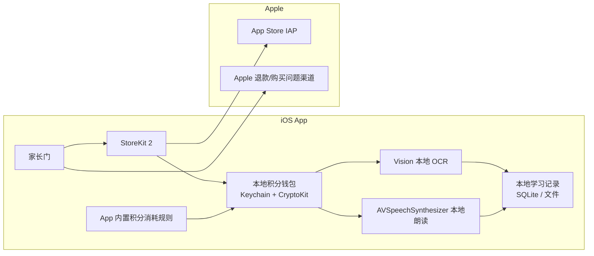
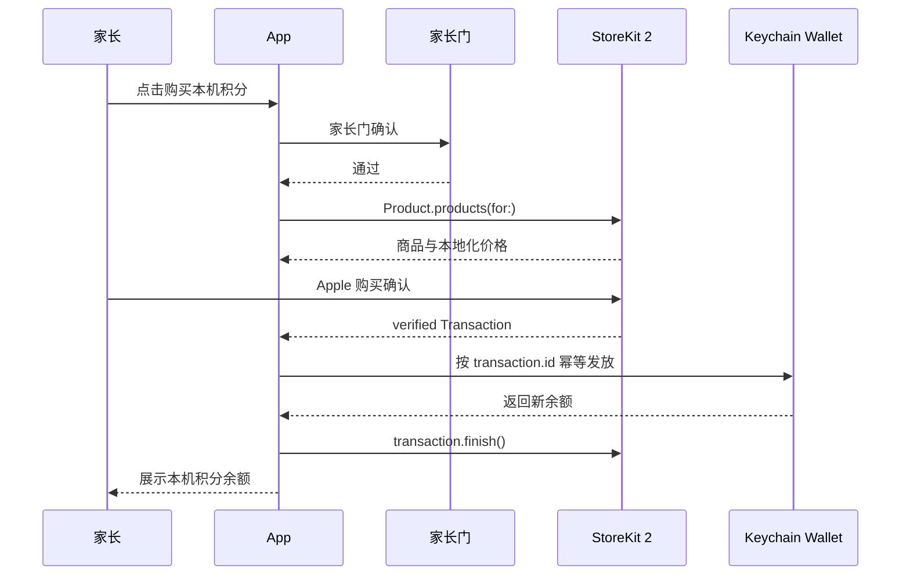

# 拍拍伴读本地持久化恢复与双积分预留方案

版本：2026-05-24  
落地目录：`backend/files`  
适用范围：拍拍伴读 iOS / iPadOS App。正式首发口径为无登录、无个人开发者自有后端、无个人开发者云端、无第三方分析广告 SDK、儿童学习内容默认不出设备。  
法律提示：本文件是工程合规和上架风控方案，不构成法律意见。个人开发者不能承诺“没有任何法律风险”；本方案目标是按 Apple、美国 COPPA、欧盟 GDPR / DSA 中更严格的口径，把数据处理和个人开发者责任压到最低。

## 0. 评估结论

原双积分支付方案的方向有可复用部分，但按“无个人开发者后端或云端、儿童最高合规要求”评估，原稿不能直接作为提审方案，必须收口：

1. 原稿仍包含后端商品配置、后端消耗规则、购买审计、退款通知、客服补偿、云端 API 钱包和数据库表。这不满足“不能存在个人开发者后端或者云端”的约束。
2. 原稿把不同功能的积分消耗规则放在后端数据库配置。无后端版本必须改为 App 内置版本化规则，通过 App 更新发布变更。
3. 原稿保留未来云端 API 积分方案。无后端最高合规版本只能在本地 schema 中预留字段，不展示、不售卖、不直连第三方 API。
4. 原稿缺少完整的本地持久化恢复边界。消耗型 IAP 不能承诺通过 StoreKit restore 全量恢复历史积分；本方案只承诺当前设备 Keychain 钱包尽量恢复。
5. 原稿的客服补偿入口会带来额外个人信息处理。最低风险首发应优先引导 Apple 官方退款/购买问题渠道；若保留邮件支持，只能由家长主动发起，且不得要求儿童内容。

修正后，本方案可以作为个人开发者 iOS 儿童 App 的低风险上架方案：只卖本地设备积分，只使用 Apple StoreKit、iOS Keychain、Vision、AVSpeechSynthesizer 等系统能力；不运营账号、服务器、云端钱包或第三方 SDK。欧盟仍需单独处理 DSA trader 联系信息展示风险。

### 0.1 上架可行性与剩余风险

按本文件边界完整落地后，方案具备正常提交 App Review 的可行性，且是个人开发者可承受的最低风险形态之一：

- App 内数字积分全部走 StoreKit IAP。
- IAP 购买、赠送或本地补发的积分不按日期过期。
- 默认不上传儿童图片、音频、OCR 文本、学习记录或设备标识。
- 不运营个人开发者后端，不引入服务器账号、云端钱包、远程日志或第三方统计广告 SDK。
- 购买、恢复/刷新购买、外链、支持、隐私文档、数据删除和本机钱包重置均在家长门后。

但本方案不能写成“保证上架”或“没有法律风险”：

- Apple Review 仍会按实际二进制、IAP 元数据、隐私标签、Review Notes 和文案一致性审核。
- 个人开发者仍需承担 IAP 消费者保护、退款争议、隐私政策准确性、欧盟 DSA trader 信息展示、税务和当地法规责任。
- Kids Category 的 parental gate 只是本地家长在场确认，不等同于 COPPA/GDPR 下完整可验证父母同意。
- 如果未来开启云 API、跨设备同步、服务端补偿或服务端购买恢复，本文件结论失效，必须重新做后端和儿童隐私合规方案。

### 0.2 必须补强的硬规则

以下规则是降低法律和上架风险的必要条件，不应在实现中弱化：

1. 积分消耗规则不能稀释已购权益。已有核心功能的 `costCredits` 只能维持或降低，不能通过 App 更新把“同一功能”从 1 积分改成 2 积分。如果要新增更高成本功能，必须新增 `featureCode/actionCode`，并在页面上清楚展示“当前消耗 X 积分”。
2. 购买页、App Store IAP 商品名、IAP 描述、服务条款和隐私政策必须一致使用“积分”口径，不得写“100 次”“有效期 30 天”或“跨设备自动恢复”。
3. 消耗型积分不承诺跨设备恢复；恢复/刷新购买只能处理未完成 StoreKit 交易和当前设备 Keychain 钱包。
4. 不做个人开发者服务器审计。所有交易去重和本机账本只保存在当前设备 Keychain；若发生 Keychain 丢失或换机争议，优先引导家长使用 Apple 官方购买问题或退款渠道。
5. App Privacy Label、`PrivacyInfo.xcprivacy`、隐私政策、儿童数据说明、App Review Notes 和实际网络行为必须一致；生产包默认路径不得请求个人开发者后端或第三方统计广告域名。
6. 欧盟上架前必须完成 DSA trader 自评。若不能接受地址、电话、邮箱在欧盟产品页展示，应暂不在欧盟 27 个地区销售。

## 1. 不可突破的产品边界

正式首发必须同时满足：

- 不创建 App 自有账号，不要求 Sign in with Apple。
- 不接入个人开发者后端、云数据库、对象存储、消息队列、日志服务或远程配置。
- 不上传孩子照片、音频、OCR 文本、绘本内容、句卡正文、孩子姓名、生日、年级、学习偏好或设备标识。
- 不接入 Firebase、友盟、AppsFlyer、Adjust、广告 SDK、录屏回放、热图、A/B 测试或第三方统计。
- 不请求 IDFA，不触发 ATT，不做跨 App 跟踪、设备指纹或行为画像。
- 购买、恢复/刷新购买、外链、支持、隐私文档、数据删除和钱包重置入口都放在家长门后。
- App 不展示、不售卖云端 API 积分。任何需要第三方云 OCR/TTS/AI 的功能都在生产环境关闭。

如果未来决定启用云 API、跨设备同步、服务端补偿或服务端购买恢复，就已经不再是本文件的无后端方案，必须另做后端、儿童隐私同意、供应商 DPA、退款撤权和数据删除方案。

## 2. 官方合规基线

### 2.1 Apple IAP

Apple App Review Guidelines 3.1.1 要求：App 内解锁数字功能、积分、游戏币、付费内容等必须使用 In-App Purchase；通过 IAP 购买的 credits / currencies 不得过期；可恢复的 IAP 应提供恢复机制。

落地规则：

- 本地 OCR、本地朗读等数字功能积分必须使用 StoreKit IAP。
- 已购积分永久有效，含义是“不按日期清零”；使用后仍会扣减。
- 每日免费额度必须和付费积分分离，不能叫“积分”。
- 不提供外部支付、网页购买、二维码付款、转账、兑换现金或法币价值。

### 2.2 StoreKit 消耗型恢复边界

StoreKit 2 口径：

- `Transaction.currentEntitlements` 不包含消耗型 IAP。
- `Transaction.all` 默认不包含普通已完成消耗型交易，只包含未完成消耗型、退款/撤销的已完成消耗型、非消耗型和订阅等。
- `SKIncludeConsumableInAppPurchaseHistory = true` 可以让 `Transaction.all` 包含已完成消耗型交易，但 Apple 官方警告启用前应具备服务端对账能力，避免重装后重复发放。

本方案结论：

- 不使用 `restoreCompletedTransactions()` 作为消耗型积分恢复依据。
- 不设置 `SKIncludeConsumableInAppPurchaseHistory = true`。
- 只处理新购买返回的 verified transaction、`Transaction.unfinished` 和 `Transaction.updates`。
- 恢复/刷新按钮只处理未完成交易、未来可恢复型权益和本机 Keychain 钱包，不承诺跨设备重算消耗型余额。

### 2.3 Kids Category

Kids Category App 的购买机会、外链和其他干扰项必须放在 parental gate 后；不应包含第三方分析或第三方广告；不应向第三方发送儿童可识别信息或设备信息。

落地规则：

- Paywall、恢复购买、支持入口、隐私政策、服务条款、数据删除和钱包重置全部在家长区或家长门后。
- 只使用 Apple StoreKit、系统 Keychain、Vision、AVSpeechSynthesizer 等平台能力。
- 不把 parental gate 宣称为 COPPA/GDPR 下的完整父母同意机制；它只是本地家长在场确认。

### 2.4 COPPA

COPPA 适用于面向 13 岁以下儿童并收集儿童个人信息的在线服务，也包括允许第三方收集儿童信息的情况。个人信息包括姓名、联系方式、持久标识符、照片、音频、精确位置等。

最低风险落地：

- 默认不收集、不上传、不共享儿童个人信息。
- 不让孩子输入姓名、生日、邮箱、手机号或公开昵称。
- 不上传照片、音频、OCR 文本、绘本原文或学习记录。
- 不接入第三方分析/广告，避免第三方通过设备信息识别儿童。

### 2.5 GDPR / GDPR-K

GDPR Article 8 对直接向儿童提供信息社会服务时的同意年龄默认使用 16 岁，成员国可降低但不得低于 13 岁；Article 25 要求数据保护设计和默认保护；Article 5 要求目的限制和数据最小化。

最低风险落地：

- 欧盟统一按 16 岁以下需要家长控制的保守口径设计。
- 默认本地处理，不把儿童数据传给开发者或第三方。
- 提供本地数据删除入口，由家长门保护。
- 不做地区画像、广告画像、行为画像或设备指纹。

### 2.6 App Privacy 与 Privacy Manifest

Apple App Privacy 中，collect 指数据离开设备并可被开发者或第三方访问超过实时请求所需时间。严格执行本方案时，儿童学习内容、积分余额和本地账本不离设备。

落地规则：

- App Store Privacy Label、隐私政策、儿童数据说明和 `PrivacyInfo.xcprivacy` 必须与代码一致。
- 如果没有后端和第三方 SDK，不把本地 OCR 图片、本地朗读文本、本地积分余额声明为开发者收集的数据。
- StoreKit 购买由 Apple 处理；本 App 只在设备 Keychain 保存本地钱包和交易 hash。

### 2.7 欧盟 DSA trader

如果在欧盟 App Store 分发并通过 IAP 商业化，Apple 会要求开发者做 DSA trader 自评。被认定为 trader 后，欧盟产品页会展示开发者提供的地址、电话、邮箱。

落地选择：

- 接受欧盟上架：准备合法商务通信地址、专用电话和专用邮箱。
- 不能接受个人联系信息展示：首发不要在欧盟 27 个地区销售。

## 3. 目标架构



关键点：

- 没有个人开发者后端。
- 没有云端钱包。
- 没有远程配置。
- 没有购买审计 outbox。
- 没有 App Store Server Notifications。
- 没有客服补偿服务器。

## 4. 积分类型

### 4.1 当前启用：本地设备积分

| 字段 | 规则 |
| --- | --- |
| 钱包 | `local_device_credits` |
| 服务类型 | `local_ocr`、`local_tts` |
| IAP 类型 | Consumable |
| 有效期 | 不按日期过期 |
| 存储位置 | 当前设备 Keychain |
| 使用条件 | 可离线使用，不需要登录，不依赖后端 |
| 消耗规则 | App 内置版本化规则，随 App 更新变化 |
| 跨设备 | 不自动同步，不承诺恢复 |
| 卸载重装 | 同一设备 Keychain 通常可保留，因此尽量恢复，但不保证 |

建议商品：

| 商品 | Product ID | 发放 |
| --- | --- | --- |
| 本机识字积分 100 | `com.paipai.readalong.local.ocr.100` | `local_ocr +100` |
| 本机识字积分 300 | `com.paipai.readalong.local.ocr.300` | `local_ocr +300` |
| 本机朗读积分 100 | `com.paipai.readalong.local.tts.100` | `local_tts +100` |
| 本机朗读积分 300 | `com.paipai.readalong.local.tts.300` | `local_tts +300` |

商品文案不得写“100 次”。应写“获得 100 本机识字积分”，使用页再说明“当前每次成功识字消耗 1 积分”。

### 4.2 每日免费额度

每日免费额度不是积分：

- 存储：`UserDefaults` 或本地 SQLite。
- 生命周期：按本地自然日重置。
- 展示：`今日免费识字剩余 3 次`。
- 恢复：卸载、清数据、换机后不恢复。
- 扣减顺序：每日免费额度优先，付费积分其次。

### 4.3 API 调用积分

无后端首发不启用 API 调用积分：

| 项 | 规则 |
| --- | --- |
| `api_call_credits` | 仅可在本地 schema 中预留为 0 |
| UI | 不展示、不售卖 |
| IAP | 不创建或不提交审核 |
| 云 OCR/TTS/AI | 生产环境关闭 |
| 第三方 API Key | 禁止写入 App 包 |

如果某个 API 实际是 Apple 设备端框架且不出设备，应归入本地设备积分，不叫云端 API 积分。

## 5. 本地积分消耗规则

无后端版本不能从数据库拉取消耗规则。App 内置规则示例：

```json
{
  "policyVersion": "local-credit-cost-20260524-001",
  "items": [
    {
      "walletType": "local_device",
      "serviceType": "local_ocr",
      "featureCode": "photo_ocr",
      "actionCode": "single_capture",
      "costCredits": 1,
      "displayName": {
        "zh-Hans": "拍照识字",
        "en": "Photo OCR"
      }
    },
    {
      "walletType": "local_device",
      "serviceType": "local_tts",
      "featureCode": "read_aloud",
      "actionCode": "default",
      "costCredits": 1,
      "displayName": {
        "zh-Hans": "朗读",
        "en": "Read aloud"
      }
    }
  ]
}
```

规则：

- `costCredits` 必须大于 0。
- 找不到规则时不得按 0 积分放行。
- 规则变更只能通过 App 更新发布，避免远程配置带来后端依赖和数据流。
- 已有核心功能的 `costCredits` 不得上调，避免稀释用户已经购买、赠送或本地补发的积分价值。
- 需要更高消耗的新能力必须使用新的 `featureCode/actionCode`，并在入口、按钮和确认页显示当前消耗积分。
- App 内展示积分余额和当前消耗值，例如“拍照识字积分：128”“每次成功识字消耗 1 积分”。

## 6. Keychain 本地钱包

### 6.1 存储策略

| 项 | 规则 |
| --- | --- |
| Keychain class | `kSecClassGenericPassword` |
| service | `com.paipai.readalong.local-wallet.<bundleId>` |
| account | `wallet.v1`、`walletKey.v1` |
| accessibility | `kSecAttrAccessibleAfterFirstUnlockThisDeviceOnly` |
| synchronizable | 不启用 |
| 加密 | CryptoKit AES.GCM 或 ChaChaPoly |
| 完整性 | AEAD tag + ledger hash |

选择 `ThisDeviceOnly` 的原因：

- 不随 iCloud Keychain 或跨设备备份迁移，符合“仅当前设备”的透明承诺。
- 降低儿童数据和权益账本被隐性同步的风险。
- 换机、抹掉设备、系统清理 Keychain 后可能无法恢复，必须在 UI 和条款中说明。

### 6.2 钱包结构

```json
{
  "schemaVersion": 1,
  "walletId": "local-random-uuid",
  "createdAt": "2026-05-24T00:00:00Z",
  "balances": {
    "local_ocr": 128,
    "local_tts": 64,
    "api_call_credits": 0
  },
  "lifetimeGranted": {
    "local_ocr": 300,
    "local_tts": 100,
    "api_call_credits": 0
  },
  "lifetimeConsumed": {
    "local_ocr": 172,
    "local_tts": 36,
    "api_call_credits": 0
  },
  "processedStoreTransactions": {
    "sha256(transaction.id)": {
      "productId": "com.paipai.readalong.local.ocr.300",
      "serviceType": "local_ocr",
      "amount": 300,
      "purchaseDate": "2026-05-24T00:01:00Z",
      "environment": "Production"
    }
  },
  "localMutations": [
    {
      "seq": 1,
      "type": "grant",
      "serviceType": "local_ocr",
      "delta": 300,
      "reason": "storekit_purchase",
      "transactionHash": "sha256(transaction.id)",
      "createdAt": "2026-05-24T00:01:01Z",
      "entryHash": "sha256(canonical-entry)"
    }
  ],
  "lastMutationSeq": 1,
  "lastMutationAt": "2026-05-24T00:01:01Z",
  "ledgerHash": "sha256(canonical-wallet-without-ledgerHash)"
}
```

隐私规则：

- 本地保存 `transaction.id` 的 hash，不保存儿童内容。
- 不保存图片路径、OCR 文本、音频路径、绘本正文或自由 payload。
- 不上传钱包到任何服务器。

### 6.3 并发与完整性

iOS 新增 `LocalCreditWalletService`，用 `actor` 串行化所有钱包读写：

```swift
actor LocalCreditWalletService {
    func grantIfNeeded(transaction: Transaction) async throws -> LocalCreditWalletSnapshot
    func consume(serviceType: LocalCreditServiceType, amount: Int, reason: String) async throws -> LocalCreditWalletSnapshot
    func snapshot() async throws -> LocalCreditWalletSnapshot
    func resetAfterParentConfirmation() async throws
}
```

规则：

- 每次写入前先解密并校验完整性。
- 每次变更更新 `lastMutationSeq` 和 `ledgerHash`。
- 校验失败进入安全模式：不允许使用付费积分，只保留每日免费额度。
- 本地防篡改目标是防普通误改和重复发放，不承诺对越狱设备绝对安全。

## 7. StoreKit 购买流程



关键规则：

- 本地积分购买不要求 App 自有登录。
- 购买前必须通过家长门。
- `Product.products(for:)` 只请求 App 内置白名单 productId。
- `VerificationResult.unverified` 不发放。
- `transaction.revocationDate != nil` 不发放。
- 消耗型 IAP 的幂等去重使用 `Transaction.id`，不是 `originalTransactionId`。
- 本地钱包写入成功后再 `transaction.finish()`。
- 如果写钱包失败，不 finish，等待 `Transaction.unfinished` 或 `Transaction.updates` 下次继续处理。

## 8. 恢复与重装

### 8.1 App 启动自动恢复

启动流程：

1. 读取 Keychain 钱包。
2. 钱包存在且校验通过：恢复余额、交易 hash 集合和本地账本。
3. 钱包不存在：初始化 0 余额钱包。
4. 扫描 `Transaction.unfinished`，对未完成交易幂等补发。
5. 开始监听 `Transaction.updates`。

用户感知：

- 同一设备卸载重装后，如果 Keychain 仍存在，余额会恢复。
- 如果 Keychain 不存在，余额为 0；无后端版本不从历史消耗型交易重建余额。

### 8.2 恢复/刷新购买按钮

位置：家长区 > 购买与数据 > 恢复/刷新购买状态。

流程：

1. 通过家长门。
2. 调用 `try await AppStore.sync()` 刷新 Apple 账户购买状态。
3. 扫描 `Transaction.unfinished` 并幂等发放。
4. 如果未来有非消耗型或订阅，扫描 `Transaction.currentEntitlements` 恢复这些可恢复权益。
5. 读取 Keychain 钱包并展示余额。
6. 没有新增交易时，显示“没有新的可恢复项目；本机积分余额已刷新”。

推荐文案：

```text
恢复/刷新购买状态
可处理 Apple 尚未完成的购买，并读取当前设备保存的本机积分。消耗型本机积分不支持跨设备自动恢复。
```

禁止文案：

- 恢复所有历史积分。
- 换设备也能找回全部积分。
- 卸载重装一定恢复。
- Apple ID 下所有消耗品都会补发。

### 8.3 换机、抹掉设备、Keychain 丢失

无后端版本不能可靠恢复已消费余额：

- StoreKit 可证明买过，但不能证明已经用了多少。
- 如果按历史购买全量补发，会重复发放已经消费的积分。
- 如果不补发，用户会感到余额丢失。
- 无服务端权威账本时，无法同时做到准确恢复、退款撤权和反重复发放。

最低风险处理：

- 购买页、设置页、隐私政策、服务条款提前说明“仅当前设备”。
- 引导家长通过 Apple 官方购买问题/退款渠道处理无法恢复争议。
- 若提供邮件支持，必须写明不要发送孩子照片、音频、OCR 文本或身份信息。

## 9. 使用与扣减

扣减顺序：

1. 先判断每日免费额度。
2. 免费额度不足时读取 App 内置消耗规则。
3. 读取 Keychain 钱包余额。
4. 余额不足则进入家长门购买。
5. 功能成功后扣减付费积分。

本地 OCR：

- Vision 成功返回可用文字后扣 `local_ocr`。
- 权限拒绝、无文字、识别失败、系统错误不扣。

本地朗读：

- `AVSpeechSynthesizer` 成功开始朗读后扣 `local_tts`。
- 无可朗读文本、无法创建语音、系统错误不扣。

写入失败：

- 不执行付费功能或提示重试，避免已扣未服务。
- App 崩溃后依赖最后一次完整钱包快照，不做半状态。

## 10. 本地数据与设置

| 数据 | 存储 | 是否离设备 | 恢复策略 |
| --- | --- | --- | --- |
| 本机积分余额 | Keychain | 否 | 同设备 Keychain 尽量恢复 |
| 已处理交易 hash | Keychain | 否 | 同设备 Keychain 尽量恢复 |
| 每日免费额度 | UserDefaults / SQLite | 否 | 不恢复，每日重置 |
| 学习记录 / 生词本 | SQLite / 文件 | 否 | 卸载删除，不恢复 |
| OCR 图片 | 内存 / 临时文件 | 否 | 处理后删除 |
| OCR 文本 / 句卡 | 本地 SQLite，可选本地加密 | 否 | 卸载删除，不恢复 |

设置页增加“数据与存储”：

- 删除本地学习数据：删除孩子资料、句卡、历史记录、OCR 缓存、音频缓存，不删除付费积分。
- 重置本机积分钱包：家长门 + 二次确认，清空 Keychain 钱包，并提示不可由开发者服务器恢复。
- 导出本地学习数据：可选，只通过系统分享面板由家长主动导出。

## 11. UI 和文案

### 11.1 README / App 介绍页

```markdown
## 数据与隐私

拍拍伴读默认在当前设备上处理学习内容。拍照识字、朗读、学习记录、生词本和历史记录不会上传到开发者服务器。

本机积分保存在当前设备的系统 Keychain 中，购买或赠送的积分不会按日期过期。删除 App 后，同一设备通常可以恢复本机积分；但更换设备、抹掉设备或系统清理 Keychain 后可能无法恢复。

每日免费次数不是付费积分，卸载或清除数据后不会恢复。
```

### 11.2 首次启动引导

```text
默认本地使用
拍照识字、朗读和学习记录默认只保存在当前设备，不上传到开发者服务器。

本机积分说明
购买的本机积分通过 Apple App 内购买完成，余额保存在当前设备 Keychain。积分不会按日期过期，但使用后会扣减；换机或抹掉设备后可能无法恢复。
```

### 11.3 设置页常驻提示

```text
本地数据
学习记录、生词本和历史记录仅保存在当前设备。卸载 App 会删除这些学习数据，开发者无法从服务器恢复。

本机积分
本机积分保存在系统 Keychain，用于当前设备的本地识字和朗读。删除 App 后通常仍可保留，但换机、抹掉设备或重置本机钱包后可能无法恢复。
```

### 11.4 购买页

```text
本机积分用于当前设备的本地识字和朗读。
购买、赠送或本地补发的积分永久有效，不按日期清零。
不同功能会按页面显示的消耗值扣减积分。
余额保存在当前设备，不会上传到开发者服务器，也不会自动同步到其他设备。
最终价格和扣款由 Apple 确认。
```

### 11.5 隐私政策补充

```text
本地学习数据：孩子的拍照图片、OCR 文字、朗读文本、生词本、学习记录和历史记录默认只保存在当前设备，不上传到开发者服务器。

本机积分：App 内购买由 Apple StoreKit 处理。本 App 在当前设备 Keychain 中保存本机积分余额和已处理交易的本地记录，用于避免重复发放和支持同一设备上的恢复。开发者不运营用于同步本机积分的服务器。

恢复限制：本机积分不自动同步到其他设备。更换设备、抹掉设备、系统清理 Keychain 或家长主动重置本机钱包后，余额可能无法恢复。
```

### 11.6 App Review Notes

```text
This Kids Category app uses on-device processing by default. OCR, read-aloud, learning records, and local credit balances are stored only on the user's device. The app does not require login, does not use a developer-operated backend for account or credit recovery, and does not integrate third-party analytics, advertising, IDFA, or tracking SDKs.

Local credits are consumable In-App Purchases used for on-device OCR/read-aloud features. Purchased credits do not expire by date. They are stored in the iOS Keychain for same-device persistence. The restore/refresh purchase button is behind a parental gate and processes unfinished StoreKit transactions plus same-device local wallet state. The app does not claim cross-device restoration of consumable credits.

All purchase opportunities, restore actions, external links, and data reset actions are behind a parental gate.
```

## 12. 当前仓库落地步骤

### P0：提审前必须完成

1. App Store Connect 创建本地积分 Consumable IAP，只提交 `local_ocr`、`local_tts` 商品。
2. 删除或隐藏所有云端 API 积分商品、云端 API 余额、云端 API 购买入口。
3. Paywall 只展示本机积分，并显示“永久有效，仅此设备离线可用”。
4. 购买入口、恢复/刷新购买、支持外链、隐私文档和数据删除入口全部接入 `ParentGateService`。
5. 新增 `LocalCreditWalletService`，用 Keychain + CryptoKit 实现本地钱包。
6. 修改 `AppStorePurchaseService`：本机积分购买不强制 `backend.hasAuthenticatedSession`，不提交后端 intake。
7. 购买成功后先写本地钱包，再 `transaction.finish()`。
8. App 启动和前台恢复时处理 `Transaction.unfinished`，并监听 `Transaction.updates`。
9. 不设置 `SKIncludeConsumableInAppPurchaseHistory`。
10. 恢复按钮改为 `AppStore.sync()` + `Transaction.unfinished` + 本机钱包刷新。
11. 本地 OCR/TTS 扣减接入本地钱包和 App 内置消耗规则；失败不扣积分。
12. 已有核心功能的 `costCredits` 不得上调；新增高成本功能必须新增 `featureCode/actionCode` 并清楚展示消耗值。
13. 前端移除“有效期 X 天”“权益次数”“次数包”“云端积分”文案。
14. 如果生产包仍包含后端代码路径，云 OCR/TTS/AI、后端权益刷新、后端购买恢复必须 fail closed 或隐藏，不得在正常用户路径触发。
15. 更新 README、首次启动、设置页、隐私政策、儿童数据说明、服务条款和 App Review Notes。
16. 复核 `PrivacyInfo.xcprivacy` 和 App Store Privacy Label，确保与“儿童数据不出设备”一致。

### P1：稳定性增强

1. 钱包 schema version 支持迁移。
2. 增加钱包完整性失败安全模式。
3. 增加 StoreKit Test 覆盖购买、pending、cancel、unfinished、重复 transaction、重装后 Keychain 读取。
4. 增加本地学习数据删除和可选导出。
5. 增加静态检查脚本，确认生产包没有第三方分析/广告 SDK 和云 API Key。

### P2：不属于无后端方案

以下能力必须另立方案，不应混入首发：

- 云端 API 积分售卖。
- 跨设备积分同步。
- 服务端购买恢复。
- App Store Server Notifications。
- 后端补偿码。
- 家长账号、云端儿童数据、云端 OCR/TTS/AI。

## 13. 测试与验收

### 13.1 StoreKit

- 新购买 `local_ocr.100` 后余额增加 100。
- 同一 `transaction.id` 重复进入处理函数不重复发放。
- 钱包写入失败时不 finish；下次 `Transaction.unfinished` 可继续处理。
- `.pending` 不发放积分。
- `.userCancelled` 不发放积分。
- `revocationDate != nil` 不发放积分。
- 恢复/刷新按钮无新增交易时显示准确文案。
- App 更新后，已有核心功能消耗值没有上调；新高成本功能使用新 `featureCode/actionCode`。

### 13.2 本地持久化

- 删除 App 后重装，同一设备如 Keychain 仍在，余额恢复。
- 删除本地学习数据后，学习记录清空，付费积分不清空。
- 重置本机钱包后，余额清空，并提示不可由服务器恢复。
- 换机、抹掉设备、Keychain 丢失场景不承诺恢复。

### 13.3 儿童隐私

- 抓包确认默认使用流程不请求个人开发者后端。
- 抓包确认 OCR 图片、音频、OCR 文本不离设备。
- 静态检查确认没有 Firebase、友盟、广告 SDK、IDFA、第三方统计 SDK、云 API Key。
- Privacy Manifest 与实际 API 使用一致。
- App Store Privacy Label、隐私政策、儿童数据说明、服务条款一致。

### 13.4 家长门

- 购买页前必须过家长门。
- 恢复/刷新购买前必须过家长门。
- 外链、支持、隐私政策、服务条款在家长区内。
- 删除本地学习数据、重置本机钱包必须过家长门并二次确认。

## 14. 明确禁止事项

1. 不承诺消耗型积分跨设备恢复。
2. 不把 `restoreCompletedTransactions()` 当作消耗型积分恢复方案。
3. 不启用 `SKIncludeConsumableInAppPurchaseHistory = true`，除非未来有服务端对账。
4. 不用 `originalTransactionId` 作为消耗型重复购买的唯一去重依据。
5. 不把 API Key 写进 App 包直连第三方云服务。
6. 不上传孩子照片、音频、OCR 文本、句卡正文或学习偏好。
7. 不接第三方分析、广告、热图、录屏、归因 SDK。
8. 不把每日免费额度叫积分。
9. 不把 Keychain 描述成 100% 不会丢失。
10. 不让付费功能依赖广告追踪、诊断上传或不必要的数据收集。
11. 不通过 App 更新提高已有核心功能的积分消耗值来稀释已购积分。

## 15. 最终产品口径

首发只展示：

```text
本机积分
拍照识字积分：128
朗读积分：64

永久有效。仅用于本设备离线识字和朗读。
拍照识字：当前每次成功识别消耗 1 积分
朗读：当前每次成功开始朗读消耗 1 积分
```

隐藏：

```text
云端 API 积分
账号同步
云端恢复
云端补偿
```

## 16. 官方来源

- Apple App Review Guidelines: https://developer.apple.com/app-store/review/guidelines/
- Apple In-App Purchase types: https://developer.apple.com/help/app-store-connect/reference/in-app-purchase-types
- StoreKit `Transaction.currentEntitlements`: https://developer.apple.com/documentation/storekit/transaction/currententitlements
- StoreKit `Transaction.all`: https://developer.apple.com/documentation/storekit/transaction/all
- `SKIncludeConsumableInAppPurchaseHistory`: https://developer.apple.com/documentation/bundleresources/information-property-list/skincludeconsumableinapppurchasehistory
- Keychain `kSecAttrAccessibleAfterFirstUnlockThisDeviceOnly`: https://developer.apple.com/documentation/security/ksecattraccessibleafterfirstunlockthisdeviceonly
- Apple App Privacy Details: https://developer.apple.com/app-store/app-privacy-details/
- Apple Privacy Manifest Files: https://developer.apple.com/documentation/bundleresources/privacy_manifest_files
- FTC COPPA six-step compliance plan: https://www.ftc.gov/business-guidance/resources/childrens-online-privacy-protection-rule-six-step-compliance-plan-your-business
- GDPR Regulation (EU) 2016/679: https://eur-lex.europa.eu/eli/reg/2016/679/oj/eng
- Apple EU DSA trader requirements: https://developer.apple.com/help/app-store-connect/manage-compliance-information/manage-european-union-digital-services-act-trader-requirements
