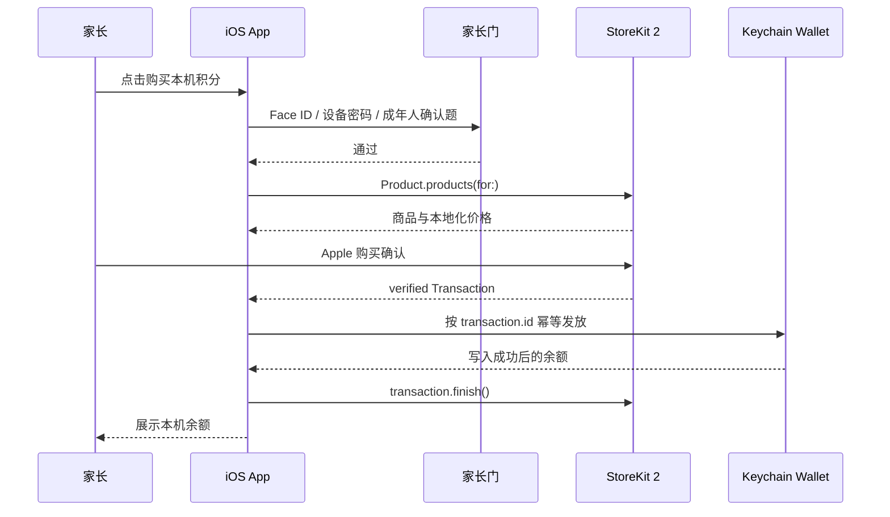

# 拍拍伴读本地持久化恢复与无自有后端儿童合规方案

版本：2026-05-24  
落地目录：`backend/files`  
适用范围：拍拍伴读 iOS / iPadOS App。目标是无登录、无个人开发者自有后端、无个人开发者云端、儿童数据默认不出设备，并在同一设备上尽可能支持已购本地积分的持久化恢复。

法律提示：本文件是工程、隐私和上架风控方案，不构成法律意见。个人开发者无法承诺“没有任何法律风险”；可执行目标是按 Apple、美国 COPPA、欧盟 GDPR / DSA 中更严格的口径做数据最小化和默认本地处理，把风险降到最低。

## 0. 最终结论

1. **最低风险首发方案：只启用本地设备积分，不启用云端 API 积分售卖。** OCR、朗读、复习、学习记录全部默认在设备本地完成，不上传孩子照片、音频、OCR 文本、句卡正文、孩子档案或设备标识。
2. **不能按原草案承诺“消耗型积分可通过 StoreKit restore 全量恢复”。** Apple StoreKit 2 的 `Transaction.currentEntitlements` 不包含消耗型 IAP；`Transaction.all` 默认也排除已完成的消耗型交易。Apple 虽提供 `SKIncludeConsumableInAppPurchaseHistory`，但官方警告要求具备服务端对账能力后再开启。无服务端时不建议启用。
3. **本机恢复依赖 Keychain，不依赖个人开发者后端。** 已购积分余额、已处理交易 ID、扣减账本保存在当前设备 Keychain。卸载重装后 Keychain 通常仍可保留，因此可以在同一设备上尽量恢复；但换机、抹掉设备、系统清理 Keychain、用户主动重置数据时不能保证恢复。
4. **消耗型积分的去重主键用 `Transaction.id`，不是 `originalTransactionId`。** 对消耗型商品，每一次购买都是独立可消耗交易，必须按 Apple 提供的唯一交易 ID 幂等发放。`originalID` 更适合订阅链或非消耗型权益关联，不应作为本地消耗型积分重复购买的唯一去重依据。
5. **恢复购买按钮可以保留，但文案必须准确。** 按钮应放在家长门后，含义是“刷新 Apple 购买状态、处理未完成交易、恢复本机 Keychain 钱包”。不能写“换设备也可恢复全部已购消耗型积分”或“删除 App 后一定恢复”。
6. **API 调用积分在无自有后端、儿童最高合规要求下不应首发售卖。** 如果 API 指第三方云 OCR/TTS/AI，硬编码 API Key、直连第三方或上传儿童内容都会显著增加安全和儿童隐私风险。只有当 API 实际是 Apple 设备端框架或完全不出设备能力时，才可以按本地设备积分计费。
7. **App Store 上架口径采用 Kids Category 严格模式。** 购买、恢复、外链、支持入口、数据重置入口均放在家长门后；不接入第三方广告、第三方分析、IDFA、指纹识别或自由诊断 payload。
8. **欧盟销售另有 DSA trader 风险。** 只要在欧盟 App Store 以 IAP 商业化，Apple 可能要求个人开发者声明 trader 并展示地址、电话、邮箱。若不能接受个人联系信息展示，应先准备合法商务地址或暂缓欧盟 27 国上架。

## 1. 合规基线

### 1.1 Apple IAP

Apple App Review Guidelines 3.1.1 要求 App 内解锁数字功能、积分、游戏币等必须使用 In-App Purchase；通过 IAP 购买的 credits / currencies 不得过期；可恢复的 IAP 需要提供恢复机制。

落地规则：

- 本地 OCR 次数、本地朗读次数属于 App 内数字功能消耗，使用 StoreKit 2 Consumable IAP。
- 已购积分永久有效，含义是“不按日期清零”，不是“不因使用而减少”。
- 每日免费额度可每日重置，但必须叫“每日免费额度”或“免费次数”，不能和付费积分混算成同一种余额。
- 不提供外部支付、兑换码售卖、网页购买、二维码付款、加密货币、现金兑换或线下转账。

### 1.2 StoreKit 消耗型恢复边界

StoreKit 2 官方口径：

- `Transaction.currentEntitlements` 包含非消耗型、订阅等当前权益，不包含已完成的消耗型 IAP。
- `Transaction.all` 默认包含未完成消耗型、退款或撤销的已完成消耗型、非消耗型和订阅；默认不包含普通已完成消耗型。
- `SKIncludeConsumableInAppPurchaseHistory = true` 可以让 `Transaction.all` 包含已完成消耗型交易，但 Apple 警告：启用前应有服务端方式对账，避免用户重装后重复发放内容。

本项目结论：

- 首发不设置 `SKIncludeConsumableInAppPurchaseHistory = true`。
- 不使用 `restoreCompletedTransactions()` 作为消耗型积分恢复依据。
- 只处理 `Transaction.unfinished`、`Transaction.updates` 和新购买返回的 verified transaction。
- 只承诺当前设备 Keychain 钱包可恢复，不承诺 Apple ID 下所有历史消耗型购买都自动重算余额。

### 1.3 Apple Kids Category

Kids Category App 的购买机会、外链和其他对儿童的干扰必须放在家长门后；不应包含第三方分析或第三方广告；不应向第三方发送儿童可识别信息或设备信息。

落地规则：

- Paywall、恢复购买、App Store 退款说明、客服/支持网页、隐私政策外链、数据重置入口全部在家长门后。
- 不集成 Firebase、友盟、AppsFlyer、Adjust、广告 SDK、A/B 测试 SDK、热更新统计 SDK 或录屏回放 SDK。
- 不请求 IDFA，不使用 ATT 弹窗，不做跨 App 跟踪。
- 崩溃日志若以后接入，也必须先评估 SDK 隐私清单，默认关闭儿童内容、文件名、OCR 文本、图片路径和设备持久标识。

### 1.4 COPPA

美国 COPPA 适用于面向 13 岁以下儿童并收集儿童个人信息的在线服务，也包括允许第三方收集儿童个人信息的情况。个人信息包括姓名、联系方式、持久标识符、照片、音频、精确地理位置等。

最低风险落地：

- 默认不收集、不上传、不共享儿童个人信息。
- 不创建账号、不要求邮箱、不让孩子输入姓名生日。
- 不上传照片、音频、OCR 文本、绘本原文或学习偏好。
- 不接入第三方分析/广告，避免第三方通过设备信息或网络信息识别儿童。
- 如以后增加云 OCR/TTS/AI，必须先做家长直接通知和可验证父母同意；这已经超出本无后端首发方案。

### 1.5 GDPR / GDPR-K

GDPR Article 8 对直接向儿童提供信息社会服务时的同意年龄默认使用 16 岁，成员国可降低但不得低于 13 岁；Article 25 要求数据保护设计和默认保护；Article 5 要求目的限制和数据最小化。

最低风险落地：

- 欧盟默认按 16 岁以下需要家长控制处理。
- 默认本地处理，不把儿童数据传给开发者或第三方。
- App 内提供本地数据删除入口，由家长门保护。
- 不做地区画像、行为画像、广告画像或设备指纹。
- 隐私政策明确说明：本地学习数据只在当前设备，开发者无法从服务器读取、恢复或删除这些本地学习内容。

### 1.6 App Privacy 与 Privacy Manifest

Apple App Privacy 口径中，"collect" 指数据离开设备并可被开发者或第三方访问超过实时请求服务所需时间。若本方案严格执行无后端、无第三方 SDK、儿童数据不出设备，则 App 本身可按“不收集儿童学习内容”填写；但仍需如实披露任何实际离设备的数据。

落地规则：

- `PrivacyInfo.xcprivacy` 与实际代码一致，特别是 UserDefaults、文件时间、磁盘空间等 Required Reason API。
- 若没有后端和第三方 SDK，StoreKit 购买在设备和 Apple 体系内完成，本项目不把交易信息上传给个人开发者服务器。
- 如果提供邮件客服，用户主动发送邮件属于 App 外支持流程；隐私政策仍要写明支持邮件可能包含家长主动提供的信息。

### 1.7 欧盟 DSA trader

在欧盟 App Store 分发并商业化时，Apple 会要求开发者进行 DSA trader 自评。被认定为 trader 后，Apple 会在欧盟产品页展示开发者提供的地址、电话、邮箱。

个人开发者选择：

- 可以接受欧盟上架：准备 P.O. Box、商务通信地址、专用邮箱和专用电话，避免直接暴露家庭住址。
- 不能接受联系信息展示：首发先不在欧盟 27 个地区销售，待信息和法律材料准备好再开放。

## 2. 积分体系

### 2.1 首发启用：本地设备积分

| 字段 | 规则 |
| --- | --- |
| 钱包名 | `local_device_credits` |
| 服务类型 | `local_ocr`、`local_tts`、`local_review` |
| IAP 类型 | Consumable |
| 余额来源 | StoreKit verified transaction、本地赠送、每日免费额度之外的家长确认补偿 |
| 有效期 | 付费和赠送积分永久有效；每日免费额度按日重置 |
| 存储位置 | 当前设备 Keychain |
| 是否同步 | 不同步到 iCloud、自有服务器或第三方 |
| 是否可换机恢复 | 不承诺 |
| 是否可卸载重装恢复 | 同一设备上尽量恢复，但不保证 |
| 是否可离线使用 | 可以 |

建议商品：

| 商品 | Product ID | 积分 |
| --- | --- | --- |
| 本机识字 100 次 | `com.paipai.readalong.local.ocr.100` | `local_ocr +100` |
| 本机识字 300 次 | `com.paipai.readalong.local.ocr.300` | `local_ocr +300` |
| 本机朗读 100 次 | `com.paipai.readalong.local.tts.100` | `local_tts +100` |
| 本机朗读 300 次 | `com.paipai.readalong.local.tts.300` | `local_tts +300` |

不建议首发混合包。混合包会增加退款解释、UI 说明、账本扣减和测试复杂度。

### 2.2 首发隐藏：API 调用积分

| 字段 | 规则 |
| --- | --- |
| 钱包名 | `api_call_credits` |
| 首发状态 | 隐藏，不展示，不售卖 |
| 原因 | 无自有后端时无法安全托管 API Key、无法权威扣减、无法处理退款撤权、无法证明第三方不收集儿童个人信息 |
| 可启用条件 | API 实际为 Apple 设备端 API 或完全本地模型；否则必须另行设计后端、DPA、家长同意和云端钱包 |

如果产品仍需要保留字段，可在本地钱包 schema 中预留：

```json
{
  "balances": {
    "local_ocr": 0,
    "local_tts": 0,
    "api_call_credits": 0
  },
  "featureFlags": {
    "paidApiCreditsEnabled": false,
    "externalCloudProcessingEnabled": false
  }
}
```

首发 UI 不展示 `api_call_credits`。如果代码中仍有云 OCR/TTS/AI 路径，必须在生产环境 fail closed。

### 2.3 每日免费额度

每日免费额度与付费积分分离：

- 存储：`UserDefaults` 或本地 SQLite 即可，不放 Keychain。
- 生命周期：按本地自然日重置。
- 文案：只能叫“今日免费次数”，不能叫“积分”。
- 恢复：卸载、换机、清数据后不恢复。
- 扣减顺序：每日免费额度优先，付费积分其次。

## 3. 本地钱包设计

### 3.1 Keychain 策略

使用 Keychain 保存钱包密文和签名密钥：

| 项 | 规则 |
| --- | --- |
| Keychain class | `kSecClassGenericPassword` |
| service | `com.paipai.readalong.local-wallet.<bundleId>` |
| account | `wallet.v1`、`walletKey.v1` |
| accessibility | `kSecAttrAccessibleAfterFirstUnlockThisDeviceOnly` |
| 同步 | 不使用 `kSecAttrSynchronizable` |
| 迁移 | 不随 iCloud Keychain 或跨设备备份迁移 |
| 加密 | `CryptoKit` AES.GCM 或 ChaChaPoly |
| 完整性 | AEAD tag + ledger hash |

说明：

- `ThisDeviceOnly` 更符合“无云、仅当前设备”的儿童隐私口径。
- 不选择 `kSecAttrAccessibleAfterFirstUnlock` 的普通迁移型属性，避免通过备份/iCloud 形成隐性跨设备同步。
- Keychain 不是“永不删除”的合同承诺，只能作为当前设备上的持久化机制。系统重置、设备迁移、用户清理、Keychain 损坏都可能导致不可恢复。

### 3.2 钱包数据结构

```json
{
  "schemaVersion": 1,
  "walletId": "local-random-uuid",
  "createdAt": "2026-05-24T00:00:00Z",
  "balances": {
    "local_ocr": 128,
    "local_tts": 64,
    "api_call_credits": 0
  },
  "lifetimeGranted": {
    "local_ocr": 300,
    "local_tts": 100,
    "api_call_credits": 0
  },
  "lifetimeConsumed": {
    "local_ocr": 172,
    "local_tts": 36,
    "api_call_credits": 0
  },
  "processedStoreTransactions": {
    "sha256(transaction.id)": {
      "productId": "com.paipai.readalong.local.ocr.300",
      "serviceType": "local_ocr",
      "amount": 300,
      "purchaseDate": "2026-05-24T00:01:00Z",
      "storefront": "USA",
      "environment": "Production",
      "finished": true
    }
  },
  "localMutations": [
    {
      "seq": 1,
      "type": "grant",
      "serviceType": "local_ocr",
      "delta": 300,
      "reason": "storekit_purchase",
      "transactionHash": "sha256(transaction.id)",
      "createdAt": "2026-05-24T00:01:01Z",
      "entryHash": "sha256(...)"
    }
  ],
  "lastMutationSeq": 1,
  "lastMutationAt": "2026-05-24T00:01:01Z",
  "ledgerHash": "sha256(canonical-json-without-ledgerHash)"
}
```

隐私原则：

- 本地可保存 `transaction.id` 的哈希，不保存明文交易 ID，除非调试环境临时需要。
- 不把钱包内容上传到个人服务器。
- 不把孩子内容、文件名、图片路径、OCR 原文写入钱包。

### 3.3 幂等与防误发

购买发放规则：

1. 仅接受 `VerificationResult.verified(Transaction)`。
2. `productID` 必须存在于本地白名单。
3. `transaction.revocationDate == nil`。
4. `transaction.id` 的 hash 不在 `processedStoreTransactions` 中。
5. 按 productId 固定映射发放积分。
6. 原子写入钱包成功后再 `await transaction.finish()`。
7. 如果写入钱包失败，不 finish，等待 `Transaction.unfinished` 或 `Transaction.updates` 下次继续处理。

扣减规则：

1. 功能成功前不扣付费积分。
2. 本地 OCR：Vision 成功返回可用文字后扣。
3. 本地朗读：`AVSpeechSynthesizer` 成功开始朗读后扣。
4. 系统权限拒绝、识别失败、无文字、语音不可用、崩溃恢复不扣。
5. 钱包解密或完整性校验失败时，不扣付费积分，进入只允许每日免费额度的安全模式。

### 3.4 并发

iOS 侧新增 `LocalCreditWalletService`，建议使用 `actor` 串行化钱包读写：

```swift
actor LocalCreditWalletService {
    func grantIfNeeded(transaction: Transaction) async throws -> LocalCreditWalletSnapshot
    func consume(serviceType: LocalCreditServiceType, amount: Int) async throws -> LocalCreditWalletSnapshot
    func snapshot() async throws -> LocalCreditWalletSnapshot
    func resetLocalWalletAfterParentConfirmation() async throws
}
```

不要在多个 ViewModel 中直接读写 Keychain。所有变更都通过 wallet actor。

## 4. 购买流程



实现步骤：

1. Paywall 进入前必须通过家长门。
2. `Product.products(for:)` 只请求本地内置的 productId 白名单。
3. 购买按钮价格以 StoreKit `displayPrice` 为准。
4. `Product.purchase()` 返回 `.success(.verified(transaction))` 后调用 `LocalCreditWalletService.grantIfNeeded(transaction:)`。
5. 钱包写入成功后再 finish。
6. `.pending` 状态提示“购买正在等待 Apple 确认，请稍后在家长区点恢复/刷新购买状态”。
7. `.userCancelled` 不提示错误。
8. 每次 App 启动监听 `Transaction.updates`，处理 App 外完成或延迟完成的交易。
9. 每次进入前台扫描 `Transaction.unfinished`，处理上次未 finish 的交易。

不需要：

- 不需要用户登录本 App。
- 不需要 Sign in with Apple。
- 不需要个人开发者后端验证交易。
- 不需要 App Store Server Notifications。
- 不需要 DeviceCheck / App Attest 服务端校验。

## 5. 恢复与重装场景

### 5.1 App 启动恢复

启动流程：

1. 读取 Keychain 钱包。
2. 如果存在且校验通过，恢复余额、已处理交易集合和本地账本。
3. 如果不存在，初始化 0 余额钱包。
4. 扫描 `Transaction.unfinished`，对未完成交易幂等补发。
5. 开始监听 `Transaction.updates`。

用户感知：

- 同一设备卸载重装后，如果 Keychain 仍在，余额会自动出现。
- 如果 Keychain 不在，则余额为 0，App 不从 StoreKit 历史消耗型交易重建余额。

### 5.2 恢复购买按钮

按钮位置：家长区 > 购买与数据 > 恢复/刷新购买状态。

按钮逻辑：

1. 过家长门。
2. 调用 `try await AppStore.sync()`，刷新 Apple 账户购买状态。
3. 扫描 `Transaction.unfinished` 并幂等发放。
4. 如果未来存在非消耗型权益或订阅，扫描 `Transaction.currentEntitlements` 并恢复这些可恢复权益。
5. 读取 Keychain 钱包并展示当前余额。
6. 如果没有新增交易，显示“没有新的可恢复项目；本机积分余额已刷新”。

按钮文案：

- 标题：`恢复/刷新购买状态`
- 说明：`可恢复当前设备保留的本机积分，并处理 Apple 尚未完成的购买。消耗型积分不支持跨设备自动恢复。`
- 成功：`已刷新，本机积分余额为 X 次。`
- 无新增：`没有新的可恢复项目。本机积分依赖当前设备保存，换机或抹掉设备后可能无法恢复。`

不要使用这些文案：

- `恢复所有历史积分`
- `换设备也能找回全部积分`
- `卸载重装一定恢复`
- `Apple ID 下所有消耗品都会补发`

### 5.3 设备丢失、换机、抹掉设备

无自有后端方案无法安全恢复已消费余额，原因：

- StoreKit 可证明历史购买，但不能证明本地已经消费了多少。
- 如果从历史购买全量补发，用户换机后可能重复获得已消费积分。
- 如果不补发，用户可能认为购买权益丢失。
- 没有服务端权威账本时，无法同时满足准确恢复、退款处理和反重复发放。

产品处理：

- 购买页提前说明“本机积分仅保存在当前设备”。
- App Store 描述和服务条款写清楚限制。
- 若希望提供人工补偿，只能走 Apple 购买记录和家长主动联系支持，但这会引入支持邮箱的数据处理义务；最低风险首发可以只引导用户通过 Apple `reportaproblem.apple.com` 处理退款。

## 6. 本地数据与儿童隐私

### 6.1 数据分类

| 数据 | 存储 | 是否离设备 | 恢复策略 |
| --- | --- | --- | --- |
| 本地积分余额 | Keychain | 否 | 同设备 Keychain 尽量恢复 |
| 已处理交易 hash | Keychain | 否 | 同设备 Keychain 尽量恢复 |
| 每日免费额度 | UserDefaults / SQLite | 否 | 不恢复，每日重置 |
| 孩子学习记录 | SQLite / 文件 | 否 | 卸载删除，不恢复 |
| OCR 图片 | 临时内存 / 临时文件 | 否 | 处理后删除 |
| OCR 文本 / 句卡 | 本地 SQLite，可选本地加密 | 否 | 卸载删除，不恢复 |
| TTS 文本 | 本地内存 / SQLite | 否 | 卸载删除，不恢复 |
| 购买交易 | StoreKit / Apple | 不上传给开发者 | 只处理当前设备可见交易 |

### 6.2 本地删除入口

设置页增加“数据与存储”：

- `删除本地学习数据`：删除孩子资料、句卡、历史记录、OCR 缓存、音频缓存，不删除付费积分。
- `重置本机积分钱包`：家长门 + 二次确认，清空 Keychain 钱包。文案必须提示“此操作会删除本机积分余额，无法通过开发者服务器恢复”。
- `导出本地学习数据`：可选。若实现，只通过系统分享面板由家长主动导出，不上传服务器。

### 6.3 权限文案

Info.plist purpose strings：

- Camera：`用于拍摄书页并在本设备上识别文字。图片不会上传到开发者服务器。`
- Photo Library Add/Read（如需要）：`用于家长选择书页图片并在本设备上识别文字。图片不会上传到开发者服务器。`
- Microphone（如未来需要跟读录音）：首发不要申请；若申请，必须说明录音仅本地处理并提供删除入口。

## 7. UI 与文案落地

### 7.1 README / App 介绍页

独立章节：

```markdown
## 数据与隐私

拍拍伴读默认在当前设备上处理学习内容。拍照识字、朗读、学习记录、生词本和历史记录不会上传到开发者服务器。

本机积分保存在当前设备的系统 Keychain 中，购买或赠送的积分不会按日期过期。删除 App 后，同一设备通常可以恢复本机积分；但更换设备、抹掉设备或系统清理 Keychain 后可能无法恢复。

每日免费次数不是付费积分，卸载或清除数据后不会恢复。
```

### 7.2 首次启动引导页

推荐文案：

```text
默认本地使用
拍照识字、朗读和学习记录默认只保存在当前设备，不上传到开发者服务器。

本机积分说明
购买的本机积分通过 Apple App 内购买完成，余额保存在当前设备 Keychain。积分不会按日期过期，但使用后会扣减；换机或抹掉设备后可能无法恢复。
```

首屏不应要求登录。只有进入购买、恢复、外链、重置积分钱包时才进入家长门。

### 7.3 设置页常驻提示

位置：设置 > 数据与存储。

```text
本地数据
学习记录、生词本和历史记录仅保存在当前设备。卸载 App 会删除这些学习数据，开发者无法从服务器恢复。

本机积分
本机积分保存在系统 Keychain，用于当前设备的本地识字和朗读。删除 App 后通常仍可保留，但换机、抹掉设备或重置本机钱包后可能无法恢复。
```

### 7.4 购买页

```text
本机积分用于当前设备的本地识字和朗读。
购买或赠送的积分永久有效，使用一次扣减一次。
余额保存在当前设备，不会上传到开发者服务器，也不会自动同步到其他设备。
最终价格和扣款由 Apple 确认。
```

### 7.5 恢复购买页

```text
恢复/刷新购买状态可处理 Apple 尚未完成的购买，并读取当前设备保存的本机积分。
消耗型本机积分不支持跨设备自动恢复。更换设备、抹掉设备或重置本机钱包后，余额可能无法找回。
```

### 7.6 隐私政策补充段落

```text
本地学习数据：孩子的拍照图片、OCR 文字、朗读文本、生词本、学习记录和历史记录默认只保存在当前设备，不上传到开发者服务器。

本机积分：App 内购买由 Apple StoreKit 处理。本 App 在当前设备 Keychain 中保存本机积分余额和已处理交易的本地记录，用于避免重复发放和支持同一设备上的恢复。开发者不运营用于同步本机积分的服务器。

恢复限制：本机积分不自动同步到其他设备。更换设备、抹掉设备、系统清理 Keychain 或家长主动重置本机钱包后，余额可能无法恢复。
```

### 7.7 App Review Notes

```text
This Kids Category app uses on-device processing by default. OCR, read-aloud, learning records, and local credit balances are stored only on the user's device. The app does not require login, does not use a developer-operated backend for account or credit recovery, and does not integrate third-party analytics, advertising, IDFA, or tracking SDKs.

Local credits are consumable In-App Purchases used for on-device OCR/read-aloud features. Purchased credits do not expire by date. They are stored in the iOS Keychain for same-device persistence. The restore/refresh purchase button is behind a parental gate and processes unfinished StoreKit transactions plus same-device local wallet state. The app does not claim cross-device restoration of consumable credits.

All purchase opportunities, restore actions, external links, and data reset actions are behind a parental gate.
```

## 8. iOS 开发步骤

### P0：无后端首发必须完成

1. 新增 `LocalCreditWalletService`，使用 Keychain + CryptoKit 保存本地钱包。
2. 新增本地 productId -> credits 映射，固定写在 App 内；只包含 `local_ocr`、`local_tts`。
3. 修改 `AppStorePurchaseService`：购买本地积分不要求 `backend.hasAuthenticatedSession`，不调用后端 intake。
4. 购买成功后先写钱包，再 `transaction.finish()`。
5. App 启动和前台恢复时处理 `Transaction.unfinished`。
6. App 生命周期内监听 `Transaction.updates`。
7. 恢复按钮改为 `AppStore.sync()` + `Transaction.unfinished` + 本地钱包刷新；不要对消耗型积分调用全量历史补发。
8. 不设置 `SKIncludeConsumableInAppPurchaseHistory`。
9. Paywall、恢复按钮、外链和数据重置全部接入 `ParentGateService`。
10. OCR/TTS 扣减接入本地钱包：每日免费额度优先，付费积分其次。
11. 生产环境禁用所有云 OCR/TTS/AI 路径和后端依赖路径。
12. 删除或隐藏 API 调用积分商品、云端积分余额、登录后恢复权益文案。
13. 更新 `PrivacyInfo.xcprivacy`、隐私政策、儿童数据说明、服务条款、App Review Notes。
14. 增加设置页“数据与存储”常驻提示和本地删除入口。

### P1：健壮性增强

1. 钱包 schema version 支持迁移。
2. `processedStoreTransactions` 最多保留必要 hash 和商品信息；长期可压缩到 Bloom/filter-like set 但不建议首发复杂化。
3. 增加钱包完整性失败的安全模式。
4. 增加本地导出学习数据能力，需家长门和系统分享面板。
5. 增加 StoreKit Test 自动化覆盖购买、pending、cancel、unfinished、重装后钱包读取。

### P2：只有改变约束后才考虑

如果未来必须卖 API 调用积分，必须放弃“无自有后端/无云端”的约束，另做：

- 家长账号。
- 直接通知和可验证父母同意。
- 后端权威云端钱包。
- API provider DPA / 数据处理协议。
- 内容零留存和日志脱敏。
- App Store Server Notifications 和退款撤权。
- 数据访问、删除、撤回同意流程。

否则不应售卖或展示 `api_call_credits`。

## 9. 测试与验收

### 9.1 StoreKit

- 新购买 `local_ocr.100` 后余额 +100。
- 同一 `transaction.id` 重复进入处理函数，不重复发放。
- 钱包写入失败时不 finish；下次 `Transaction.unfinished` 可继续处理。
- `.pending` 不发放积分。
- `.userCancelled` 不发放积分。
- `revocationDate != nil` 的交易不发放。
- App 启动监听 `Transaction.updates`。
- 恢复按钮无新增交易时显示准确文案。

### 9.2 本地持久化

- 删除 App 后重装，同一设备如 Keychain 仍在，余额恢复。
- 设置页删除本地学习数据后，学习记录清空，付费积分不清空。
- 设置页重置本机钱包后，余额清空，并提示不可由服务器恢复。
- 换机或抹掉设备场景文案不承诺恢复。

### 9.3 儿童隐私

- 抓包确认默认使用流程不请求个人开发者后端。
- 抓包确认 OCR 图片、音频、OCR 文本不离设备。
- `rg` 检查生产 build 不包含 Firebase、友盟、广告 SDK、IDFA、第三方统计 SDK。
- Privacy Manifest 与实际 API 使用一致。
- App Store Privacy Label 与实际数据流一致。

### 9.4 家长门

- 购买页前必须过家长门。
- 恢复/刷新购买前必须过家长门。
- 外链、客服、隐私政策打开前必须过家长门或至少在家长区内。
- 删除本地学习数据、重置本机钱包必须过家长门并二次确认。

## 10. 明确禁止事项

1. 不要承诺消耗型积分跨设备恢复。
2. 不要把 `restoreCompletedTransactions()` 当作消耗型积分恢复方案。
3. 不要启用 `SKIncludeConsumableInAppPurchaseHistory = true`，除非未来有服务端对账。
4. 不要用 `originalTransactionId` 作为消耗型重复购买的唯一去重依据。
5. 不要把 API Key 写进 App 包内直连第三方云服务。
6. 不要上传孩子照片、音频、OCR 文本、句卡正文或学习偏好。
7. 不要接第三方分析、广告、热图、录屏、归因 SDK。
8. 不要把每日免费额度叫积分。
9. 不要把 Keychain 描述成 100% 不会丢失。
10. 不要让付费功能依赖用户同意广告追踪、诊断上传或不必要的数据收集。

## 11. 官方来源

- Apple App Review Guidelines: https://developer.apple.com/app-store/review/guidelines/
- Apple In-App Purchase types: https://developer.apple.com/help/app-store-connect/reference/in-app-purchase-types
- StoreKit `Transaction.currentEntitlements`: https://developer.apple.com/documentation/storekit/transaction/currententitlements
- StoreKit `Transaction.all`: https://developer.apple.com/documentation/storekit/transaction/all
- `SKIncludeConsumableInAppPurchaseHistory`: https://developer.apple.com/documentation/bundleresources/information-property-list/skincludeconsumableinapppurchasehistory
- Keychain `kSecAttrAccessibleAfterFirstUnlockThisDeviceOnly`: https://developer.apple.com/documentation/security/ksecattraccessibleafterfirstunlockthisdeviceonly
- Apple App Privacy Details: https://developer.apple.com/app-store/app-privacy-details/
- Apple Privacy Manifest Files: https://developer.apple.com/documentation/bundleresources/privacy_manifest_files
- FTC COPPA six-step compliance plan: https://www.ftc.gov/business-guidance/resources/childrens-online-privacy-protection-rule-six-step-compliance-plan-your-business
- GDPR Regulation (EU) 2016/679: https://eur-lex.europa.eu/eli/reg/2016/679/oj/eng
- Apple EU DSA trader requirements: https://developer.apple.com/help/app-store-connect/manage-compliance-information/manage-european-union-digital-services-act-trader-requirements

